# SIEM HomeLab — Part 2: Wazuh Dashboard Deployment

| Field | Details |
|---|---|
| **Lab Type** | Cybersecurity / SIEM Homelab |
| **Platform** | VMware Workstation • Ubuntu Server 24.04.4 LTS |
| **Date** | March 2026 |
| **Component** | Wazuh Dashboard (OpenSearch Dashboards) — Single-Node Deployment |

---

## Table of Contents

1. [Introduction](#1-introduction)
2. [Lab Environment](#2-lab-environment)
3. [Key Concepts](#3-key-concepts)
4. [Pre-Installation — Certificate Revision](#4-pre-installation--certificate-revision)
5. [Installation & Configuration](#5-installation--configuration)
6. [Verification](#6-verification)
7. [Observations & Notes](#7-observations--notes)
8. [Conclusion](#8-conclusion)

---

## 1. Introduction

### 1.1 Lab Overview

This document covers Part 2 of a multi-part SIEM (Security Information and Event Management) HomeLab series. Part 1 deployed the Wazuh Indexer on a dedicated VM (`192.168.71.100`). Part 2 deploys the Wazuh Dashboard on a second VM (`192.168.71.103`), providing the web-based visualisation and monitoring interface for the Wazuh SIEM stack.

This part also covers an important remediation step: because the `wazuh-dashboard` node was not included in the initial certificate configuration performed in Part 1, all TLS certificates had to be regenerated before the Dashboard installation could proceed. A secondary misconfiguration in the Wazuh Indexer `opensearch.yml` was also identified and corrected during this process.

### 1.2 What Is the Wazuh Dashboard?

The Wazuh Dashboard is the web-based front-end for the Wazuh SIEM platform. Built on **OpenSearch Dashboards**, it provides:

- Real-time security event visualisation and alerting
- Threat hunting and investigation workflows
- Regulatory compliance reporting (PCI DSS, HIPAA, NIST, etc.)
- Agent health monitoring and management
- Configurable dashboards, index patterns, and custom queries

The Dashboard communicates with the Wazuh Indexer over HTTPS (port `9200`) and with the Wazuh Server API over HTTPS (port `55000`). All inter-component traffic is encrypted using the TLS certificates generated in Part 1 (and updated in this lab).

### 1.3 Role in the SIEM Architecture

The Wazuh Dashboard sits at the presentation layer of the full SIEM stack planned for this HomeLab series:

| Component | Role | Status |
|---|---|---|
| **Wazuh Indexer (OpenSearch)** | Data storage and search layer | Part 1 |
| **Wazuh Dashboard** | Web-based visualisation and monitoring UI | *This lab* |
| **Graylog** | Log collection and processing (replaces the Wazuh Filebeat pipeline) | Future |
| **Grafana** | Additional dashboarding and alerting | Future |
| **Cassandra / MySQL** | Supporting databases for Graylog | Future |

> **Note:** Because Graylog has not yet been deployed, the Wazuh Server (manager) is also not yet in place. The Dashboard will display a "no server connected" warning on first login. This is expected and will be resolved in a later part of this series.

---

## 2. Lab Environment

### 2.1 Host Platform

| Setting | Value |
|---|---|
| **Hypervisor** | VMware Workstation |
| **Operating System** | Ubuntu Server 24.04.4 LTS (Noble Numbat) |
| **Hostname** | `wazuh-dashboard` |
| **ISO Source** | https://ubuntu.com/download/server |

### 2.2 Virtual Machine Specifications

| Resource | Specification |
|---|---|
| **CPU** | 1 Processor, 2 Cores |
| **RAM** | 2 GB |
| **Disk** | 40 GB (single virtual disk file) |
| **Network** | VMware NAT — `192.168.71.0/24` |
| **Static IP** | `192.168.71.103` |
| **Default Gateway** | `192.168.71.2` |

> **Note:** The Wazuh Dashboard has lower resource requirements than the Indexer. 2 GB RAM and 2 cores are sufficient for the dashboard web server process.

### 2.3 Network Port Requirements

The following TCP ports must be accessible between Wazuh components:

| Component | Port / Protocol | Purpose |
|---|---|---|
| Wazuh Indexer | `9200` TCP | RESTful API (Dashboard → Indexer) |
| Wazuh Dashboard | `443` TCP | Web User Interface (Browser → Dashboard) |
| Wazuh Server API | `55000` TCP | Server API (Dashboard → Server) |

---

## 3. Key Concepts

### 3.1 Certificate-Based Mutual TLS

Wazuh enforces TLS across all inter-component communications. Each component requires its own certificate and key pair, as well as the shared root CA certificate. If any component is added after the initial certificate generation pass, **all certificates must be regenerated** to include the new component entry. This is the situation encountered in this lab when the `wazuh-dashboard` node was added to `config.yml` retroactively.

### 3.2 opensearch_dashboards.yml

The Wazuh Dashboard is configured primarily through `/etc/wazuh-dashboard/opensearch_dashboards.yml`. Key parameters include:

| Parameter | Description |
|---|---|
| `server.host` | The IP address this node listens on |
| `server.port` | The HTTPS port (default: `443`) |
| `opensearch.hosts` | The Wazuh Indexer endpoint(s) to connect to |
| `server.ssl.certificate` | Path to the dashboard TLS certificate |
| `server.ssl.key` | Path to the dashboard private key |
| `opensearch.ssl.certificateAuthorities` | Path to the root CA certificate |

---

## 4. Pre-Installation — Certificate Revision

During Part 1, TLS certificates were generated using `wazuh-certs-tool.sh` with a `config.yml` that did not include a `wazuh-dashboard` node entry. Before the Dashboard can be installed, `config.yml` on the Wazuh Indexer must be updated to add the dashboard node, and all certificates must be regenerated. The existing Indexer certificates must also be replaced.

---

### Step 1 — Create the Wazuh Dashboard Virtual Machine

Create a new VM in VMware Workstation using the **Ubuntu Server 24.04.4 LTS** ISO with the specifications defined in Section 2:

- CPU: 1 Processor, 2 Cores
- RAM: 2 GB
- Disk: 40 GB — *Store virtual disk as a single file*
- Network: VMware NAT

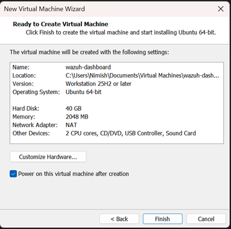

During OS installation, configure the system user credentials and hostname:

- **Username:** `support`
- **Hostname:** `wazuh-dashboard`

---

### Step 2 — Configure Static IP and Hostname

Assign a static IP address to the `wazuh-dashboard` VM. The static IP `192.168.71.103` is used throughout this lab.

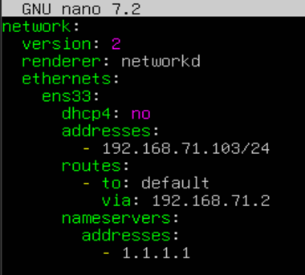

After boot, update `/etc/hosts` on the Wazuh Indexer VM to include the new dashboard node, and verify the dashboard VM can resolve the indexer hostname:

```bash
# /etc/hosts entry on the Wazuh Indexer
192.168.71.103 wazuh-dashboard
```

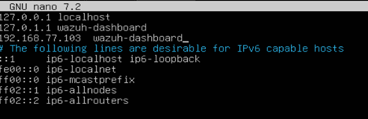

---

### Step 3 — Update config.yml on the Indexer Node

On the Wazuh Indexer VM, update the certificate generation configuration file to add the `wazuh-dashboard` node entry. The `wazuh-dashboard` section must specify the node name and its static IP address.

> **Correction:** The `wazuh-dashboard` node was not included in the original `config.yml` used in Part 1. This required all certificates to be regenerated. The dashboard entry was added at this step to ensure the new certificate set covers all three planned components: `wazuh-indexer`, `wazuh-dashboard`, and the future Graylog/server node.

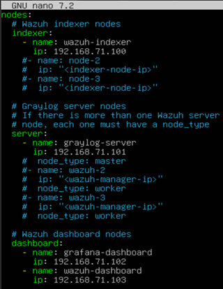

---

### Step 4 — Regenerate TLS Certificates

With `config.yml` updated, regenerate all TLS certificates using the `wazuh-certs-tool.sh` script. This will produce a new certificate set that includes `wazuh-dashboard`.

```bash
bash ./wazuh-certs-tool.sh -A
```

The script deletes any existing `wazuh-certificates` directory and generates a fresh set.

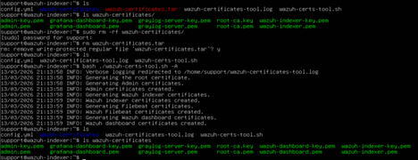

---

### Step 5 — Replace Certificates on the Wazuh Indexer

The Indexer is currently running with the old (Part 1) certificates. These must be replaced with the newly generated set.

#### 5a — Delete the old certificates from the Indexer

```bash
sudo rm -rf /etc/wazuh-indexer/certs/*
```

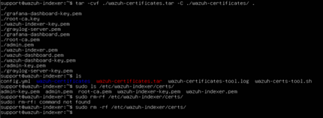

#### 5b — Extract the new Indexer certificates from the tar archive

```bash
NODE_NAME=wazuh-indexer

sudo tar -xf ./wazuh-certificates.tar -C /etc/wazuh-indexer/certs/ \
  ./$NODE_NAME.pem \
  ./$NODE_NAME-key.pem \
  ./admin.pem \
  ./admin-key.pem \
  ./root-ca.pem
```


#### 5c — Set correct file permissions and ownership

```bash
sudo chmod 500 /etc/wazuh-indexer/certs
sudo bash -c 'chmod 400 /etc/wazuh-indexer/certs/*'
sudo chown -R wazuh-indexer:wazuh-indexer /etc/wazuh-indexer/certs
```

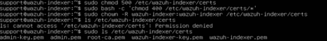

> **Important:** The shell expands wildcards (`*`) before `sudo` gains root privileges. Wrapping the `chmod` command in `bash -c` ensures the elevated context applies to the full glob expression. This was also noted in Part 1, Section 7.1.

---

### Step 6 — Correct the CN Misconfiguration in opensearch.yml

During certificate replacement, a misconfiguration was identified in the Wazuh Indexer's `/etc/wazuh-indexer/opensearch.yml`. The CN (Common Name) entry for the node certificate was incorrect and had to be updated to match the hostname.

> **Correction:** This misconfiguration was present from Part 1 and was not caught during initial deployment. It was identified here when verifying the certificate configuration against the newly generated files. The `plugins.security.authcz.admin_dn` and `plugins.security.nodes_dn` entries were corrected to reflect the proper `CN=wazuh-indexer` value.

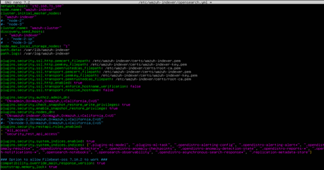

---

## 5. Installation & Configuration

### Step 7 — Transfer Certificates to the Dashboard VM

Three certificate files must be securely copied from the Wazuh Indexer to the `wazuh-dashboard` VM. Only the following files are required for the Dashboard; the admin certificates remain on the Indexer only:

- `wazuh-dashboard.pem` — The Dashboard node certificate
- `wazuh-dashboard-key.pem` — The Dashboard private key
- `root-ca.pem` — The shared root Certificate Authority

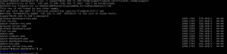

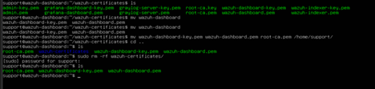

---

### Step 8 — Install Package Dependencies

On the `wazuh-dashboard` VM, install the required system packages before adding the Wazuh repository:

```bash
sudo apt-get install debhelper tar curl libcap2-bin
```

---

### Step 9 — Add the Wazuh Repository

#### 9a — Install GPG and HTTPS transport dependencies

```bash
sudo apt-get install gnupg apt-transport-https
```

#### 9b — Import the Wazuh GPG signing key

```bash
sudo curl -s https://packages.wazuh.com/key/GPG-KEY-WAZUH | \
  sudo gpg --no-default-keyring \
           --keyring gnupg-ring:/usr/share/keyrings/wazuh.gpg \
           --import \
  && sudo chmod 644 /usr/share/keyrings/wazuh.gpg
```

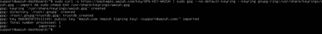

#### 9c — Add the Wazuh apt repository

```bash
echo "deb [signed-by=/usr/share/keyrings/wazuh.gpg] \
  https://packages.wazuh.com/4.x/apt/ stable main" | \
  sudo tee -a /etc/apt/sources.list.d/wazuh.list
```


#### 9d — Update package metadata

```bash
sudo apt-get update
```

---

### Step 10 — Install the Wazuh Dashboard Package

```bash
sudo apt-get -y install wazuh-dashboard
```

---

### Step 11 — Configure opensearch_dashboards.yml

Edit the main Dashboard configuration file. Two key values must be changed:

- `server.host` — Set to the dashboard VM's static IP: `192.168.71.103`
- `opensearch.hosts` — Set to the Wazuh Indexer URL: `https://wazuh-indexer:9200`

```bash
sudo nano /etc/wazuh-dashboard/opensearch_dashboards.yml
```

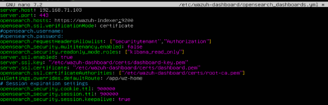

> **Note:** The `wazuh-indexer` hostname mapping will be added to `/etc/hosts` in Step 17. It can be added at any point before the service starts; the hostname must be resolvable at runtime.

---

### Step 12 — Deploy Certificates on the Dashboard VM

Create the certificate directory and move the transferred certificate files into it. The following commands assume the working directory is `/home/support` and that the three certificate files (`wazuh-dashboard.pem`, `wazuh-dashboard-key.pem`, `root-ca.pem`) are present there.

#### 12a — Set the node name and create the certificate directory

```bash
NODE_NAME=wazuh-dashboard
sudo mkdir /etc/wazuh-dashboard/certs
```

#### 12b — Move the certificate files into the certs directory

```bash
sudo mv -n $NODE_NAME.pem /etc/wazuh-dashboard/certs/dashboard.pem
sudo mv -n $NODE_NAME-key.pem /etc/wazuh-dashboard/certs/dashboard-key.pem
sudo mv -n root-ca.pem /etc/wazuh-dashboard/certs/root-ca.pem
```

#### 12c — Set permissions and ownership

```bash
sudo chmod 500 /etc/wazuh-dashboard/certs
sudo bash -c 'chmod 400 /etc/wazuh-dashboard/certs/*'
sudo chown -R wazuh-dashboard:wazuh-dashboard /etc/wazuh-dashboard/certs
```

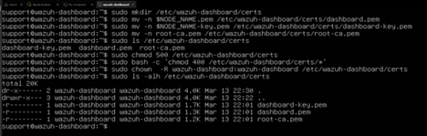

---

### Step 13 — Rename Certificates to Hostname Convention

The Wazuh documentation's default `mv` commands name the dashboard certificate files `dashboard.pem` and `dashboard-key.pem`. To maintain a consistent naming convention that matches the hostname (as used on the Indexer), these files are renamed:

```bash
sudo mv /etc/wazuh-dashboard/certs/dashboard-key.pem \
        /etc/wazuh-dashboard/certs/wazuh-dashboard-key.pem

sudo mv /etc/wazuh-dashboard/certs/dashboard.pem \
        /etc/wazuh-dashboard/certs/wazuh-dashboard.pem
```

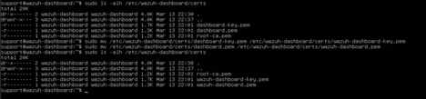

---

### Step 14 — Update Certificate Paths in opensearch_dashboards.yml

Re-open `opensearch_dashboards.yml` and update the certificate and key path references to point to the renamed files:

```bash
sudo nano /etc/wazuh-dashboard/opensearch_dashboards.yml
```

Update the following values:

```yaml
server.ssl.key: "/etc/wazuh-dashboard/certs/wazuh-dashboard-key.pem"
server.ssl.certificate: "/etc/wazuh-dashboard/certs/wazuh-dashboard.pem"
```

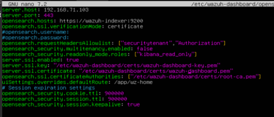

---

### Step 15 — Start the Wazuh Dashboard Service

Reload the systemd daemon to pick up any service file changes, then enable and start the Wazuh Dashboard service:

```bash
sudo systemctl daemon-reload
sudo systemctl enable wazuh-dashboard
sudo systemctl start wazuh-dashboard
```

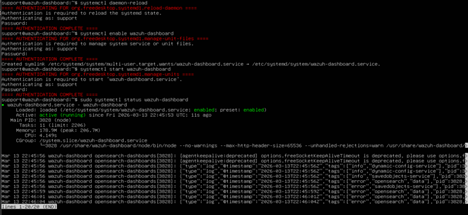

---

### Step 16 — Configure wazuh.yml

Edit the Wazuh API connection configuration file to point the Dashboard at the Wazuh Server (manager). Although the Wazuh Server is not yet deployed in this lab, this file must reference the correct address for when it becomes available:

```bash
sudo nano /usr/share/wazuh-dashboard/data/wazuh/config/wazuh.yml
```

Update the `hosts` section with the following values:

```yaml
hosts:
  - default:
      url: https://192.168.71.100
      port: 55000
      username: wazuh-wui
      password: wazuh-wui
      run_as: true
```

> **Note:** The URL `192.168.71.100` is the Wazuh Indexer's IP address, used here as a placeholder. In a full deployment, this should point to the Wazuh Server (manager) API address. This will be updated when the Wazuh Server is deployed in a later part of this series.

---

### Step 17 — Add /etc/hosts Mapping for wazuh-indexer

Add a hostname resolution entry on the Dashboard VM so that the `opensearch.hosts` value (configured in Step 11 as `https://wazuh-indexer:9200`) correctly resolves to the Indexer IP:

```bash
sudo nano /etc/hosts
```

```bash
# /etc/hosts entry on the wazuh-dashboard VM
192.168.71.100 wazuh-indexer
```

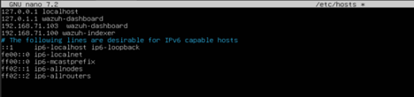

---

## 6. Verification

### 6.1 Access the Dashboard Web Interface

Open a browser and navigate to the Dashboard VM's IP address over HTTPS:

```
https://192.168.71.103
```

The Wazuh Dashboard login page should load. Accept any browser TLS warning generated by the self-signed root CA (this is expected in a homelab environment). Log in with the default admin credentials:

- **Username:** `admin`
- **Password:** `admin` *(as set during Wazuh Indexer initialisation)*

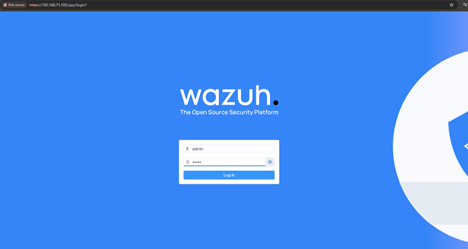

### 6.2 Initial Login Observation — No Server Connected

On first login, the Dashboard displays a warning indicating that no Wazuh Server (manager) is connected. This is the expected state at this stage, as the Wazuh Server has not yet been deployed in this HomeLab series.

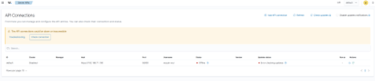

This warning will be resolved when the Wazuh Server (or its replacement component) is deployed and `wazuh.yml` is updated to point to the correct server API endpoint.

---

## 7. Observations & Notes

### 7.1 Certificate Regeneration Required When Adding a New Component

The `wazuh-dashboard` node was not included in the `config.yml` used during the Part 1 certificate generation pass. The `wazuh-certs-tool.sh` script generates all certificates in a single operation based on the node list in `config.yml`. Because the Dashboard was added after the fact, the entire certificate set had to be regenerated.

**Best practice:** Define all planned Wazuh stack components in `config.yml` before running `wazuh-certs-tool.sh`, even if those components have not yet been provisioned. This avoids the need for certificate regeneration and the associated re-deployment work on already-running nodes.

### 7.2 CN Misconfiguration in opensearch.yml Identified During This Lab

A misconfiguration in the `plugins.security.nodes_dn` and `plugins.security.authcz.admin_dn` entries of `/etc/wazuh-indexer/opensearch.yml` was identified during the certificate replacement process in Step 6. The Common Name (CN) values did not correctly match the certificate CN.

This misconfiguration originated in Part 1 and was not caught during initial deployment. It was corrected at this stage. Always cross-reference the CN values in `opensearch.yml` against the certificates generated by `wazuh-certs-tool.sh` to ensure alignment.

### 7.3 Certificate Naming Convention

The Wazuh official documentation's default `mv` commands rename the dashboard certificate files to generic names: `dashboard.pem` and `dashboard-key.pem`. In this lab, a hostname-based naming convention was adopted (`wazuh-dashboard.pem`, `wazuh-dashboard-key.pem`), consistent with how the Indexer's certificates are named. This improves clarity in multi-component environments where multiple certificate sets coexist.

When adopting a non-default naming convention, ensure all references in `opensearch_dashboards.yml` are updated accordingly, as was done in Step 14.

### 7.4 Wildcard sudo chmod — Repeated Gotcha

As noted in Part 1 (Section 7.1), the standard usage of `sudo chmod 400 /etc/wazuh-dashboard/certs/*` fails because the shell expands the wildcard **before** `sudo` elevates privileges. The correct workaround — wrapping the command in `bash -c` — was applied consistently in this lab:

```bash
sudo bash -c 'chmod 400 /etc/wazuh-dashboard/certs/*'
```

### 7.5 Dashboard Shows No Server Connection — Expected Behaviour

The "no Wazuh server connected" message displayed on first login is expected. The Wazuh Dashboard requires a running Wazuh Server (manager) to fully populate its security event views. The `wazuh.yml` file has been pre-configured with a placeholder address (`192.168.71.100`), which currently points to the Indexer. This will be updated in a later lab part when the Server component is deployed.

---

## 8. Conclusion

Part 2 of the SIEM HomeLab series successfully deployed the Wazuh Dashboard on a dedicated Ubuntu Server 24.04.4 LTS VM running in VMware Workstation, completing the full workflow from VM provisioning through to verified web access at `https://192.168.71.103`.

**Achievements in this lab:**

- Provisioned a second Ubuntu Server VM with specifications appropriate for the Wazuh Dashboard web server
- Identified and resolved the missing `wazuh-dashboard` node in `config.yml`, requiring a full TLS certificate regeneration
- Replaced the Wazuh Indexer's certificate set with the newly generated files and corrected a pre-existing CN misconfiguration in `opensearch.yml`
- Transferred the three required Dashboard certificate files (node cert, private key, root CA) to the Dashboard VM
- Installed all package dependencies, added the Wazuh apt repository, and installed the `wazuh-dashboard` package
- Configured `opensearch_dashboards.yml` with the correct `server.host` IP, Indexer endpoint, and renamed certificate paths
- Deployed and correctly permissioned the TLS certificate files under `/etc/wazuh-dashboard/certs/`
- Enabled and started the Wazuh Dashboard systemd service and confirmed it is active
- Configured `wazuh.yml` with the Wazuh Server API placeholder address for future use
- Verified successful browser access to the Dashboard login page; observed the expected no-server warning on first login

---

> **Next Steps:** Part 3 will deploy **Graylog** as the log collection and forwarding layer, configure it to ingest security events and forward them to the Wazuh Indexer, and begin connecting the full SIEM pipeline. Once the Graylog integration is in place, `wazuh.yml` will be updated with the correct server endpoint and the Dashboard's no-server warning will be resolved.
