# SIEM HomeLab — Part 4: Wazuh Manager Server Deployment

| Field | Details |
|---|---|
| **Author** | Nimish Sood |
| **Project** | SIEM HomeLab Project |
| **Lab Type** | Cybersecurity / SIEM Homelab |
| **Platform** | VMware Workstation • Ubuntu Server 24.04 LTS |
| **Date** | May 2026 |
| **Series** | SIEM HomeLab - Wazuh + Graylog + Grafana |
| **Category** | Cybersecurity |
| **Component** | Wazuh Manager Server |

---

## Table of Contents

1. [Introduction](#1-introduction)
2. [Lab Environment](#2-lab-environment)
3. [Installation and Configuration](#3-installation-and-configuration)
4. [Configure Graylog to Receive Wazuh Events](#4-configure-graylog-to-receive-wazuh-events)
5. [Install and Configure Fluent Bit on the Wazuh Manager](#5-install-and-configure-fluent-bit-on-the-wazuh-manager)
6. [Verify Wazuh Manager to Graylog Forwarding](#6-verify-wazuh-manager-to-graylog-forwarding)
7. [Connect the Wazuh Dashboard to the Wazuh Manager](#7-connect-the-wazuh-dashboard-to-the-wazuh-manager)
8. [Wazuh Manager Hardening and Feature Tuning](#8-wazuh-manager-hardening-and-feature-tuning)
9. [Optional Advanced Detection Rules from SOCFortress](#9-optional-advanced-detection-rules-from-socfortress)
10. [Verification Checklist](#10-verification-checklist)
11. [Observations and Notes](#11-observations-and-notes)
12. [Conclusion](#12-conclusion)

---

## 1. Introduction

### 1.1 Lab Overview

This document covers Part 4 of the SIEM HomeLab series. Part 2 deployed the Wazuh Dashboard, and Part 3 deployed the Graylog Server. Part 4 deploys and configures the Wazuh Manager Server on a dedicated Ubuntu Server VM, then connects it into the existing lab architecture.

The Wazuh Manager is the central analysis and coordination component of the Wazuh platform. It receives events from Wazuh agents, evaluates those events against Wazuh rulesets, generates alerts, and writes alert output such as `alerts.json`. In this lab, the manager does not forward data directly to the Wazuh Indexer with Filebeat. Instead, Fluent Bit reads Wazuh alert output and forwards it to Graylog.

> **Note:** Every screenshot, command, configuration block, troubleshooting note, correction, and technical observation from my raw Part 4 notes is preserved and integrated into this professional version. Incorrect attempts are retained and clearly marked rather than silently removed.

### 1.2 What Is the Wazuh Manager?

Wazuh is an open-source endpoint detection and response and SIEM platform made up of server-side components and endpoint-side agents. The Wazuh Manager is responsible for receiving agent data, decoding events, applying rules, producing alerts, and coordinating agent registration and configuration.

The Wazuh ruleset is the logic layer that analyzes incoming logs. Rules are customizable, which allows noisy alerts to be tuned, custom detection logic to be created, and environment-specific security monitoring to be added.

Unlike traditional antivirus software, which primarily identifies malware on a machine, Wazuh helps build the broader chain of events around endpoint activity. It can collect and analyze network connections, DNS queries, commands executed, user logins, PowerShell activity, process creation events, and many other endpoint signals.

Wazuh also provides file integrity monitoring, vulnerability detection, policy monitoring, regulatory compliance features, and third-party integrations. It includes a RESTful API that can be used to interact with endpoints or trigger custom scripts when specific rules fire.

### 1.3 Role in the SIEM Architecture

The intended flow for this HomeLab is:

- Wazuh agents collect endpoint telemetry from monitored systems.
- The Wazuh Manager receives those events and analyzes them against its rulesets.
- When a rule matches, Wazuh writes the resulting alert to `alerts.json`.
- Fluent Bit reads the alert output and forwards it to Graylog over TCP.
- Graylog receives, buffers, and later parses the event data.
- The Wazuh Dashboard connects to the Wazuh Manager API so the deployment can be managed from the web interface.

> **Architecture note:** This lab intentionally avoids the default Filebeat-to-Wazuh-Indexer forwarding path. Graylog is used as the log handling layer before data is sent onward in later parts of the series.

---

## 2. Lab Environment

### 2.1 Virtual Machine Specifications

A new virtual machine was created for the Wazuh Manager using the following resource allocation:

| Resource | Specification |
|---|---|
| **Hostname / VM Role** | `wazuh-manager` |
| **Operating System** | Ubuntu Server 24.04 LTS |
| **CPU** | 4 cores |
| **RAM** | 6 GB |
| **Disk** | 80 GB SSD-backed virtual disk |
| **Network** | VMware NAT lab network |

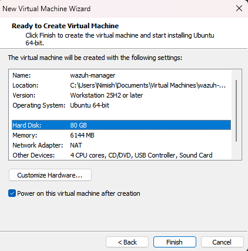

### 2.2 Static IP Addressing

A static IP address was assigned so that Graylog, the Dashboard, and future Wazuh agents can consistently reach the manager.

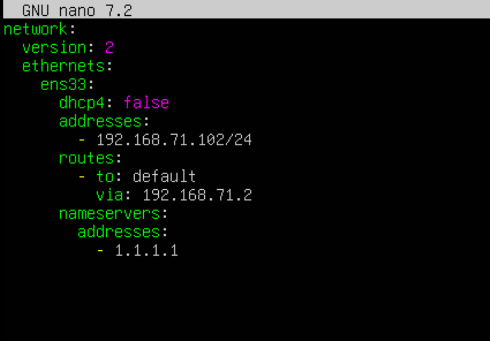

### 2.3 Related Lab Components

The Part 4 deployment depends on the earlier SIEM components already created in the series:

| Component | Status |
|---|---|
| **Wazuh Indexer** | Deployed in Part 1 |
| **Wazuh Dashboard** | Deployed in Part 2 |
| **Graylog Server** | Deployed in Part 3 at `192.168.71.101` |
| **Wazuh Manager** | Deployed in this document |

---

## 3. Installation and Configuration

### Step 1 — Update the Ubuntu Server VM

After the VM was created and assigned a static IP address, the package metadata was updated and available packages were upgraded.

```bash
sudo apt update
sudo apt upgrade
```

---

### Step 2 — Install Required Package Dependencies

The Wazuh repository setup requires GnuPG and HTTPS transport support for apt.

```bash
sudo apt-get install gnupg apt-transport-https
```

---

### Step 3 — Import the Wazuh GPG Key

The raw notes captured the Wazuh GPG key import command. The command must use two normal ASCII hyphens before import.

> **Warning:** The raw command contained an incorrect dash before import: –import. That character is an en dash, not two ASCII hyphens. It can cause the command to fail. The corrected command is shown immediately after the preserved raw attempt.

Preserved raw attempt:

```bash
curl -s https://packages.wazuh.com/key/GPG-KEY-WAZUH | sudo gpg --no-default-keyring --keyring gnupg-ring:/usr/share/keyrings/wazuh.gpg –import
```

Corrected command used for a reliable installation:

```bash
curl -s https://packages.wazuh.com/key/GPG-KEY-WAZUH | sudo gpg --no-default-keyring --keyring gnupg-ring:/usr/share/keyrings/wazuh.gpg --import
sudo chmod 644 /usr/share/keyrings/wazuh.gpg
```

---

### Step 4 — Add the Wazuh apt Repository

The Wazuh 4.x apt repository was added to the system and package metadata was refreshed.

```bash
echo "deb [signed-by=/usr/share/keyrings/wazuh.gpg] https://packages.wazuh.com/4.x/apt/ stable main" | sudo tee /etc/apt/sources.list.d/wazuh.list
sudo apt-get update
```

---

### Step 5 — Install and Start the Wazuh Manager

The Wazuh Manager package was installed, enabled, and started through systemd.

```bash
sudo apt-get -y install wazuh-manager
sudo systemctl daemon-reload
sudo systemctl enable wazuh-manager
sudo systemctl start wazuh-manager
```

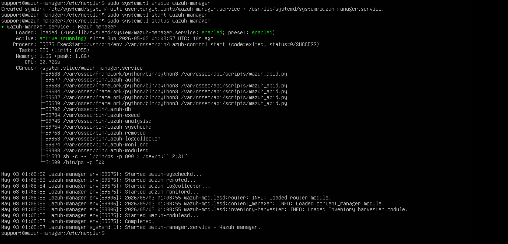

> **Design decision:** Filebeat is intentionally not configured in this deployment. This lab forwards Wazuh alerts to Graylog instead of sending them directly to the Wazuh Indexer.

---

## 4. Configure Graylog to Receive Wazuh Events

### Step 6 — Create a Raw/Plaintext TCP Input in Graylog

Before forwarding alerts from Wazuh Manager, Graylog must be configured to listen for incoming events. In the Graylog web interface, navigate to System > Inputs, select Raw/Plaintext TCP, and launch a new input.

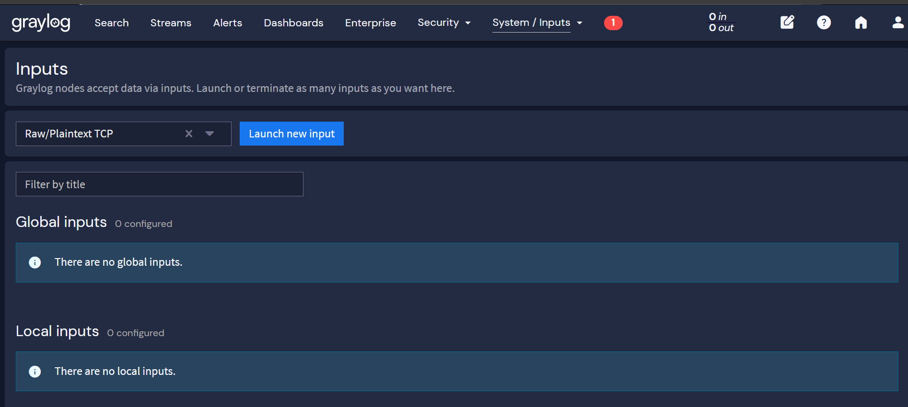

Use the following input settings:

| Setting | Value |
|---|---|
| **Title** | `WAZUH EVENTS FLUENT BIT - TCP` |
| **Bind address** | `0.0.0.0` |
| **Port** | `5555` |

> **Production note:** TLS was not enabled for this HomeLab input. In production, TLS is strongly recommended so Wazuh alert data is not transmitted in cleartext.

Click Save to create the input.

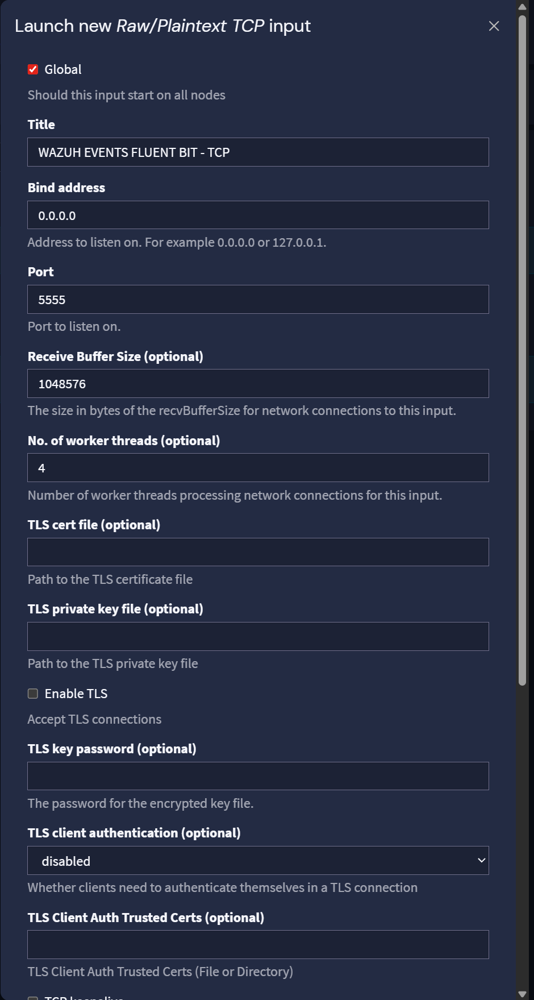

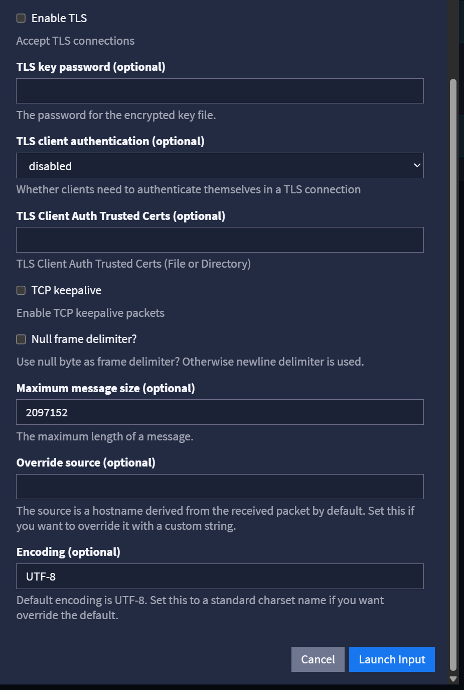

---

### Step 7 — Start the Graylog Input and Verify Listening Port

After launching the input, start it from the Graylog interface. Then confirm that Graylog is listening on TCP port 5555.

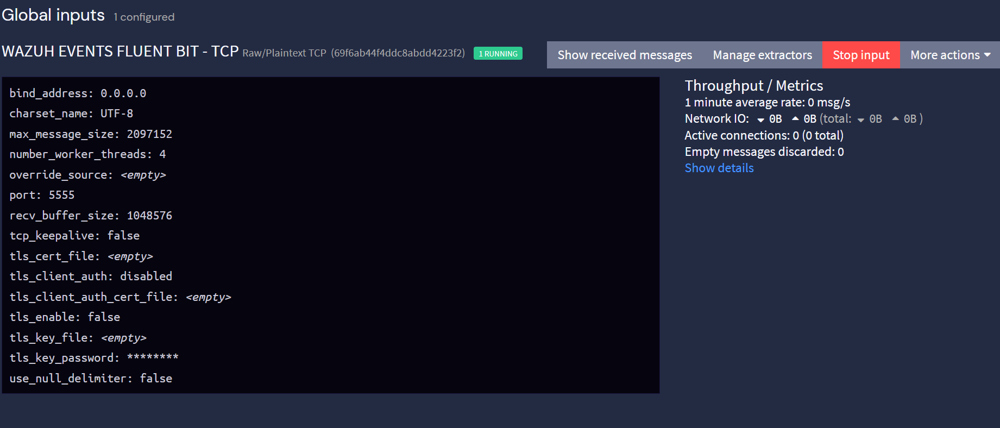

```bash
ss -ltnpd
```

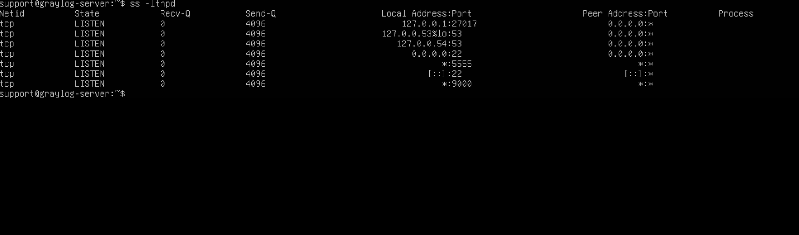

At this stage, no Wazuh events are being sent yet. The input is ready, but the Wazuh Manager still needs a forwarder configured.

---

## 5. Install and Configure Fluent Bit on the Wazuh Manager

### Step 8 — Install Fluent Bit

Fluent Bit is used as the lightweight log forwarder between Wazuh Manager and Graylog. It is a better fit for this Graylog-based design than the default Wazuh Filebeat pipeline because the lab is not forwarding directly to the Wazuh Indexer.

After the Wazuh Manager receives an event and analyzes it against its rulesets, matching alerts are written to the Wazuh `alerts.json` file. Fluent Bit is configured to read that output and forward it to Graylog.

```bash
curl https://raw.githubusercontent.com/fluent/fluent-bit/master/install.sh | sh
```

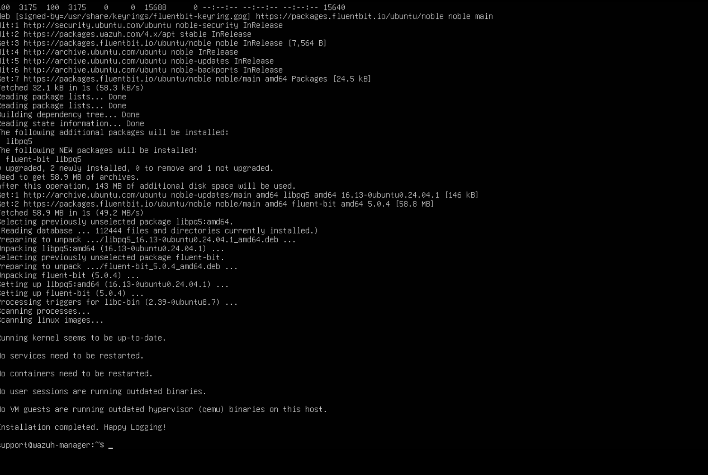

After installation, the new Fluent Bit configuration directory should exist at `/etc/fluent-bit`.

---

### Step 9 — Review and Edit fluent-bit.conf

The main configuration file is `/etc/fluent-bit/fluent-bit.conf`. This file controls what is collected and where it is forwarded.

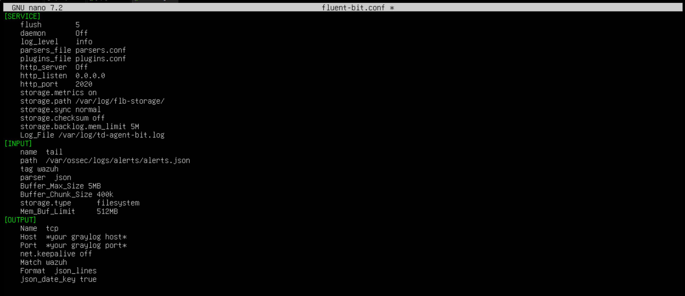

The notes identify that multiple tags can be used if the environment later has multiple Wazuh managers. For this deployment, the important change is the output section.

Update the output destination so Fluent Bit sends events to the Graylog server:

| Setting | Value |
|---|---|
| **Host** | `192.168.71.101` |
| **Port** | `5555` |

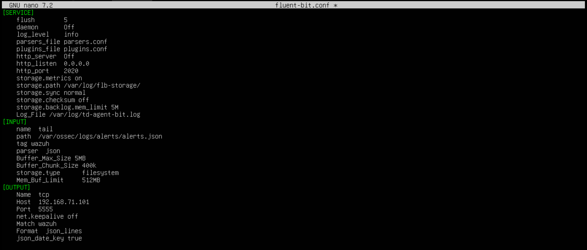

---

### Step 10 — Enable and Start Fluent Bit

Enable and start the Fluent Bit service so it begins forwarding Wazuh alert output automatically.

```bash
sudo systemctl enable fluent-bit
sudo systemctl start fluent-bit
```

Check the Fluent Bit log to confirm that the worker started successfully:

```bash
tail -f /var/log/td-agent-bit.log
```

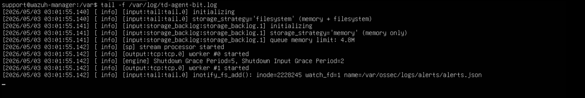

---

## 6. Verify Wazuh Manager to Graylog Forwarding

### 6.1 Confirm Network Transfer on the Graylog Input

Once Fluent Bit is running, the connection between Wazuh Manager and Graylog should be established and logs should begin forwarding.

On the Graylog web interface, the input network details showed approximately 5.4 KB of total transfer. These initial events came from activity already present on the Wazuh Manager server, such as SSH and sudo usage. This confirms that the connection path is working.

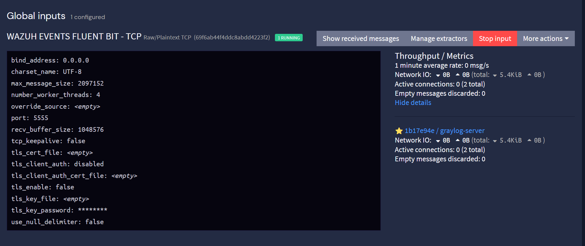

### 6.2 Inspect Raw Wazuh Messages in Graylog

The received messages can be opened and reviewed in detail from the Graylog interface.

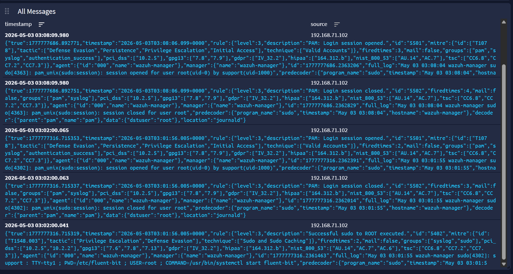

> **Parsing note:** At this stage, events are still arriving as a single raw block. Later parts of the series will parse these messages into separate Graylog fields.

---

## 7. Connect the Wazuh Dashboard to the Wazuh Manager

Now that the Wazuh Manager is online, the Wazuh Dashboard deployed in Part 2 can be pointed to the manager API.

On the Wazuh Dashboard machine, edit the Wazuh dashboard configuration file:

```bash
sudo nano /usr/share/wazuh-dashboard/data/wazuh/config/wazuh.yml
```

Update the URL so the dashboard points to the Wazuh Manager.

After a successful change, the Wazuh Dashboard first-login home page should load with the manager connection in place.

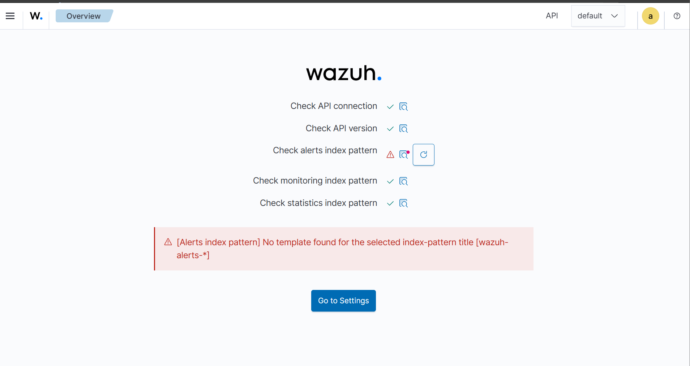

> **Expected observation:** The Alert Index Pattern warning is expected at this stage of the deployment.

---

## 8. Wazuh Manager Hardening and Feature Tuning

### 8.1 Enable Agent Registration Password

By default in the raw notes, the Wazuh Manager was listening for agent registration on port `1515`, and any agent attempting to connect could register. To improve security, a registration password is enabled.

Open the manager configuration file:

```bash
sudo nano /var/ossec/etc/ossec.conf
```

In the auth block, change:

```xml
<use_password>no</use_password>
```

to:

```xml
<use_password>yes</use_password>
```

Create the password file:

```bash
sudo nano /var/ossec/etc/authd.pass
```

Then set permissions and ownership so the Wazuh process can read it securely:

```bash
sudo chmod 640 /var/ossec/etc/authd.pass
sudo chown root:wazuh /var/ossec/etc/authd.pass
```

### 8.2 Enable Vulnerability Detection

Vulnerability detection may already be enabled by default on newer versions of Wazuh. The raw notes still capture the explicit enablement step.

Open the manager configuration file again:

```bash
sudo nano /var/ossec/etc/ossec.conf
```

In the vulnerability-detector block, change:

```xml
<enabled>no</enabled>
```

to:

```xml
<enabled>yes</enabled>
```

> **Version note:** Per-OS vulnerability detector blocks may not be present in newer Wazuh Manager versions. Enable only the blocks that exist in the installed version and match the operating systems you plan to monitor.

### 8.3 Create Agent Groups for OS-Specific Configuration

The deployment uses agent groups so Linux and Windows agents can receive operating-system-specific monitoring policies.

In the Wazuh Dashboard, navigate to Agent Management > Groups.

#### 8.3.1 Linux Agent Group Configuration

Create a new group named Linux and paste the following configuration. Any agent placed in this group will receive this Linux-specific Wazuh agent configuration.

```xml
<agent_config>
    <client_buffer>
        <!-- Agent buffer options -->
        <disabled>no</disabled>
        <queue_size>5000</queue_size>
        <events_per_second>500</events_per_second>
    </client_buffer>
    <!-- Policy monitoring -->
    <rootcheck>
        <disabled>no</disabled>
        <!-- Frequency that rootcheck is executed - every 12 hours -->
        <frequency>43200</frequency>
        <rootkit_files>/var/ossec/etc/shared/rootkit_files.txt</rootkit_files>
        <rootkit_trojans>/var/ossec/etc/shared/rootkit_trojans.txt</rootkit_trojans>
        <system_audit>/var/ossec/etc/shared/system_audit_rcl.txt</system_audit>
        <system_audit>/var/ossec/etc/shared/system_audit_ssh.txt</system_audit>
        <system_audit>/var/ossec/etc/shared/cis_debian_linux_rcl.txt</system_audit>
        <skip_nfs>yes</skip_nfs>
    </rootcheck>
    <wodle name="open-scap">
        <disabled>yes</disabled>
        <timeout>1800</timeout>
        <interval>1d</interval>
        <scan-on-start>yes</scan-on-start>
        <content type="xccdf" path="ssg-debian-8-ds.xml">
            <profile>xccdf_org.ssgproject.content_profile_common</profile>
        </content>
        <content type="oval" path="cve-debian-oval.xml"/>
    </wodle>
    <!-- File integrity monitoring -->
    <syscheck>
        <disabled>no</disabled>
        <!-- Frequency that syscheck is executed default every 12 hours -->
        <frequency>43200</frequency>
        <scan_on_start>yes</scan_on_start>
        <!-- Directories to check  (perform all possible verifications) -->
        <directories>/etc,/usr/bin,/usr/sbin</directories>
        <directories>/bin,/sbin,/boot</directories>
        <!-- Files/directories to ignore -->
        <ignore>/etc/mtab</ignore>
        <ignore>/etc/hosts.deny</ignore>
        <ignore>/etc/mail/statistics</ignore>
        <ignore>/etc/random-seed</ignore>
        <ignore>/etc/random.seed</ignore>
        <ignore>/etc/adjtime</ignore>
        <ignore>/etc/httpd/logs</ignore>
        <ignore>/etc/utmpx</ignore>
        <ignore>/etc/wtmpx</ignore>
        <ignore>/etc/cups/certs</ignore>
        <ignore>/etc/dumpdates</ignore>
        <ignore>/etc/svc/volatile</ignore>
        <ignore>/sys/kernel/security</ignore>
        <ignore>/sys/kernel/debug</ignore>
        <!-- File types to ignore -->
        <ignore type="sregex">.log$|.swp$</ignore>
        <!-- Check the file, but never compute the diff -->
        <nodiff>/etc/ssl/private.key</nodiff>
        <skip_nfs>yes</skip_nfs>
        <skip_dev>yes</skip_dev>
        <skip_proc>yes</skip_proc>
        <skip_sys>yes</skip_sys>
        <!-- Nice value for Syscheck process -->
        <process_priority>10</process_priority>
        <!-- Maximum output throughput -->
        <max_eps>100</max_eps>
        <!-- Database synchronization settings -->
        <synchronization>
            <enabled>yes</enabled>
            <interval>5m</interval>
            <response_timeout>30</response_timeout>
            <queue_size>16384</queue_size>
            <max_eps>10</max_eps>
        </synchronization>
    </syscheck>
    <!-- Log analysis -->
    <localfile>
        <log_format>syslog</log_format>
        <location>/var/ossec/logs/active-responses.log</location>
    </localfile>
    <localfile>
        <log_format>syslog</log_format>
        <location>/var/log/messages</location>
    </localfile>
    <localfile>
        <log_format>syslog</log_format>
        <location>/var/log/auth.log</location>
    </localfile>
    <localfile>
        <log_format>syslog</log_format>
        <location>/var/log/syslog</location>
    </localfile>
    <localfile>
        <log_format>command</log_format>
        <command>df -P</command>
        <frequency>360</frequency>
    </localfile>
    <localfile>
        <log_format>full_command</log_format>
        <command>netstat -tan |grep LISTEN |grep -v 127.0.0.1 | sort</command>
        <frequency>360</frequency>
    </localfile>
    <localfile>
        <log_format>full_command</log_format>
        <command>last -n 5</command>
        <frequency>360</frequency>
    </localfile>
    <wodle name="osquery">
        <disabled>yes</disabled>
        <run_daemon>yes</run_daemon>
        <log_path>/var/log/osquery/osqueryd.results.log</log_path>
        <config_path>/etc/osquery/osquery.conf</config_path>
        <add_labels>yes</add_labels>
    </wodle>
    <wodle name="syscollector">
        <disabled>no</disabled>
        <interval>24h</interval>
        <scan_on_start>yes</scan_on_start>
        <packages>yes</packages>
        <os>yes</os>
        <hotfixes>yes</hotfixes>
        <ports all="no">yes</ports>
        <processes>yes</processes>
    </wodle>
</agent_config>
```

#### 8.3.2 Windows Agent Group Configuration

Create a new group named Windows and paste the following configuration. This configuration includes Windows file integrity monitoring, registry monitoring, Sysmon log collection, PowerShell event collection, Task Scheduler logs, Windows Defender logs, and other event channels.

```xml
<agent_config>
    <client_buffer>
        <!-- Agent buffer options -->
        <disabled>no</disabled>
        <queue_size>5000</queue_size>
        <events_per_second>500</events_per_second>
    </client_buffer>
    <!-- Policy monitoring -->
    <rootcheck>
        <disabled>no</disabled>
        <windows_apps>./shared/win_applications_rcl.txt</windows_apps>
        <windows_malware>./shared/win_malware_rcl.txt</windows_malware>
    </rootcheck>
    <sca>
        <enabled>yes</enabled>
        <scan_on_start>yes</scan_on_start>
        <interval>12h</interval>
        <skip_nfs>yes</skip_nfs>
    </sca>
    <!-- File integrity monitoring -->
    <syscheck>
        <disabled>no</disabled>
        <!-- Frequency that syscheck is executed default every 12 hours -->
        <frequency>43200</frequency>
        <!-- Default files to be monitored. -->
        <directories recursion_level="0" restrict="regedit.exe$|system.ini$|win.ini$">%WINDIR%</directories>
        <directories recursion_level="0" restrict="at.exe$|attrib.exe$|cacls.exe$|cmd.exe$|eventcreate.exe$|ftp.exe$|lsass.exe$|net.exe$|net1.exe$|netsh.exe$|reg.exe$|regedt32.exe|regsvr32.exe|runas.exe|sc.exe|schtasks.exe|sethc.exe|subst.exe$">%WINDIR%\SysNative</directories>
        <directories recursion_level="0">%WINDIR%\SysNative\drivers\etc</directories>
        <directories recursion_level="0" restrict="WMIC.exe$">%WINDIR%\SysNative\wbem</directories>
        <directories recursion_level="0" restrict="powershell.exe$">%WINDIR%\SysNative\WindowsPowerShell\v1.0</directories>
        <directories recursion_level="0" restrict="winrm.vbs$">%WINDIR%\SysNative</directories>
        <!-- 32-bit programs. -->
        <directories recursion_level="0" restrict="at.exe$|attrib.exe$|cacls.exe$|cmd.exe$|eventcreate.exe$|ftp.exe$|lsass.exe$|net.exe$|net1.exe$|netsh.exe$|reg.exe$|regedit.exe$|regedt32.exe$|regsvr32.exe$|runas.exe$|sc.exe$|schtasks.exe$|sethc.exe$|subst.exe$">%WINDIR%\System32</directories>
        <directories recursion_level="0">%WINDIR%\System32\drivers\etc</directories>
        <directories recursion_level="0" restrict="WMIC.exe$">%WINDIR%\System32\wbem</directories>
        <directories recursion_level="0" restrict="powershell.exe$">%WINDIR%\System32\WindowsPowerShell\v1.0</directories>
        <directories recursion_level="0" restrict="winrm.vbs$">%WINDIR%\System32</directories>
        <directories realtime="yes">%PROGRAMDATA%\Microsoft\Windows\Start Menu\Programs\Startup</directories>
        <ignore>%PROGRAMDATA%\Microsoft\Windows\Start Menu\Programs\Startup\desktop.ini</ignore>
        <ignore type="sregex">.log$|.htm$|.jpg$|.png$|.chm$|.pnf$|.evtx$</ignore>
        <!-- Windows registry entries to monitor. -->
        <windows_registry>HKEY_LOCAL_MACHINE\Software\Classes\batfile</windows_registry>
        <windows_registry>HKEY_LOCAL_MACHINE\Software\Classes\cmdfile</windows_registry>
        <windows_registry>HKEY_LOCAL_MACHINE\Software\Classes\comfile</windows_registry>
        <windows_registry>HKEY_LOCAL_MACHINE\Software\Classes\exefile</windows_registry>
        <windows_registry>HKEY_LOCAL_MACHINE\Software\Classes\piffile</windows_registry>
        <windows_registry>HKEY_LOCAL_MACHINE\Software\Classes\AllFilesystemObjects</windows_registry>
        <windows_registry>HKEY_LOCAL_MACHINE\Software\Classes\Directory</windows_registry>
        <windows_registry>HKEY_LOCAL_MACHINE\Software\Classes\Folder</windows_registry>
        <windows_registry arch="both">HKEY_LOCAL_MACHINE\Software\Classes\Protocols</windows_registry>
        <windows_registry arch="both">HKEY_LOCAL_MACHINE\Software\Policies</windows_registry>
        <windows_registry>HKEY_LOCAL_MACHINE\Security</windows_registry>
        <windows_registry arch="both">HKEY_LOCAL_MACHINE\Software\Microsoft\Internet Explorer</windows_registry>
        <windows_registry>HKEY_LOCAL_MACHINE\System\CurrentControlSet\Services</windows_registry>
        <windows_registry>HKEY_LOCAL_MACHINE\System\CurrentControlSet\Control\Session Manager\KnownDLLs</windows_registry>
        <windows_registry>HKEY_LOCAL_MACHINE\System\CurrentControlSet\Control\SecurePipeServers\winreg</windows_registry>
        <windows_registry arch="both">HKEY_LOCAL_MACHINE\Software\Microsoft\Windows\CurrentVersion\Run</windows_registry>
        <windows_registry arch="both">HKEY_LOCAL_MACHINE\Software\Microsoft\Windows\CurrentVersion\RunOnce</windows_registry>
        <windows_registry>HKEY_LOCAL_MACHINE\Software\Microsoft\Windows\CurrentVersion\RunOnceEx</windows_registry>
        <windows_registry arch="both">HKEY_LOCAL_MACHINE\Software\Microsoft\Windows\CurrentVersion\URL</windows_registry>
        <windows_registry arch="both">HKEY_LOCAL_MACHINE\Software\Microsoft\Windows\CurrentVersion\Policies</windows_registry>
        <windows_registry arch="both">HKEY_LOCAL_MACHINE\Software\Microsoft\Windows NT\CurrentVersion\Windows</windows_registry>
        <windows_registry arch="both">HKEY_LOCAL_MACHINE\Software\Microsoft\Windows NT\CurrentVersion\Winlogon</windows_registry>
        <windows_registry arch="both">HKEY_LOCAL_MACHINE\Software\Microsoft\Active Setup\Installed Components</windows_registry>
        <!-- Windows registry entries to ignore. -->
        <registry_ignore>HKEY_LOCAL_MACHINE\Security\Policy\Secrets</registry_ignore>
        <registry_ignore>HKEY_LOCAL_MACHINE\Security\SAM\Domains\Account\Users</registry_ignore>
        <registry_ignore type="sregex">\Enum$</registry_ignore>
        <registry_ignore>HKEY_LOCAL_MACHINE\System\CurrentControlSet\Services\MpsSvc\Parameters\AppCs</registry_ignore>
        <registry_ignore>HKEY_LOCAL_MACHINE\System\CurrentControlSet\Services\MpsSvc\Parameters\PortKeywords\DHCP</registry_ignore>
        <registry_ignore>HKEY_LOCAL_MACHINE\System\CurrentControlSet\Services\MpsSvc\Parameters\PortKeywords\IPTLSIn</registry_ignore>
        <registry_ignore>HKEY_LOCAL_MACHINE\System\CurrentControlSet\Services\MpsSvc\Parameters\PortKeywords\IPTLSOut</registry_ignore>
        <registry_ignore>HKEY_LOCAL_MACHINE\System\CurrentControlSet\Services\MpsSvc\Parameters\PortKeywords\RPC-EPMap</registry_ignore>
        <registry_ignore>HKEY_LOCAL_MACHINE\System\CurrentControlSet\Services\MpsSvc\Parameters\PortKeywords\Teredo</registry_ignore>
        <registry_ignore>HKEY_LOCAL_MACHINE\System\CurrentControlSet\Services\PolicyAgent\Parameters\Cache</registry_ignore>
        <registry_ignore>HKEY_LOCAL_MACHINE\Software\Microsoft\Windows\CurrentVersion\RunOnceEx</registry_ignore>
        <registry_ignore>HKEY_LOCAL_MACHINE\System\CurrentControlSet\Services\ADOVMPPackage\Final</registry_ignore>
        <!-- Frequency for ACL checking (seconds) -->
        <windows_audit_interval>60</windows_audit_interval>
        <!-- Nice value for Syscheck module -->
        <process_priority>10</process_priority>
        <!-- Maximum output throughput -->
        <max_eps>100</max_eps>
        <!-- Database synchronization settings -->
        <synchronization>
            <enabled>yes</enabled>
            <interval>5m</interval>
            <max_interval>1h</max_interval>
            <max_eps>10</max_eps>
        </synchronization>
    </syscheck>
    <!-- System inventory -->
    <wodle name="syscollector">
        <disabled>no</disabled>
        <interval>1h</interval>
        <scan_on_start>yes</scan_on_start>
        <hardware>yes</hardware>
        <os>yes</os>
        <network>yes</network>
        <packages>yes</packages>
        <ports all="no">yes</ports>
        <processes>yes</processes>
        <!-- Database synchronization settings -->
        <synchronization>
            <max_eps>10</max_eps>
        </synchronization>
    </wodle>
    <!-- CIS policies evaluation -->
    <wodle name="cis-cat">
        <disabled>yes</disabled>
        <timeout>1800</timeout>
        <interval>1d</interval>
        <scan-on-start>yes</scan-on-start>
        <java_path>\\server\jre\bin\java.exe</java_path>
        <ciscat_path>C:\cis-cat</ciscat_path>
    </wodle>
    <!-- Osquery integration -->
    <wodle name="osquery">
        <disabled>yes</disabled>
        <run_daemon>yes</run_daemon>
        <bin_path>C:\Program Files\osquery\osqueryd</bin_path>
        <log_path>C:\Program Files\osquery\log\osqueryd.results.log</log_path>
        <config_path>C:\Program Files\osquery\osquery.conf</config_path>
        <add_labels>yes</add_labels>
    </wodle>
    <!-- Active response -->
    <active-response>
        <disabled>no</disabled>
        <ca_store>wpk_root.pem</ca_store>
        <ca_verification>yes</ca_verification>
    </active-response>
    <!-- Log analysis -->
    <localfile>
        <location>Microsoft-Windows-Sysmon/Operational</location>
        <log_format>eventchannel</log_format>
    </localfile>
    <localfile>
        <location>Windows PowerShell</location>
        <log_format>eventchannel</log_format>
    </localfile>
    <localfile>
        <location>Microsoft-Windows-CodeIntegrity/Operational</location>
        <log_format>eventchannel</log_format>
    </localfile>
    <localfile>
        <location>Microsoft-Windows-TaskScheduler/Operational</location>
        <log_format>eventchannel</log_format>
    </localfile>
    <localfile>
        <location>Microsoft-Windows-PowerShell/Operational</location>
        <log_format>eventchannel</log_format>
    </localfile>
    <localfile>
        <location>Microsoft-Windows-Windows Firewall With Advanced Security/Firewall</location>
        <log_format>eventchannel</log_format>
    </localfile>
    <localfile>
        <location>Microsoft-Windows-Windows Defender/Operational</location>
        <log_format>eventchannel</log_format>
    </localfile>
</agent_config>
```

### 8.4 Restart Wazuh Manager

After applying manager-side settings and group configurations, restart the Wazuh Manager so the changes are applied.

```bash
sudo systemctl restart wazuh-manager
```

---

## 9. Optional Advanced Detection Rules from SOCFortress

The raw notes identify a later enhancement: adding advanced Wazuh detection rules from the SOCFortress Wazuh-Rules repository.

Repository referenced in the lab notes:

```text
https://github.com/socfortress/Wazuh-Rules
```

Credit: SOCFortress

> **Warning:** Before applying third-party rules, verify there are no duplicate rule IDs or collisions with existing custom rules. Duplicate rule IDs can cause the Wazuh Manager service to fail.

Run the following commands on the Wazuh Manager VM, not the dashboard VM.

Become root:

```bash
sudo -i
```

Download the script:

```bash
curl -sLo /root/wazuh_socfortress_rules.sh https://raw.githubusercontent.com/socfortress/Wazuh-Rules/main/wazuh_socfortress_rules.sh
```

Inspect the script before running it:

```bash
less /root/wazuh_socfortress_rules.sh
```

Then run it:

```bash
bash /root/wazuh_socfortress_rules.sh
```

If it fails, check the Wazuh Manager service logs:

```bash
journalctl -u wazuh-manager -xe --no-pager
```

or:

```bash
tail -n 100 /var/ossec/logs/ossec.log
```

After the rules are applied, the new rules can be viewed in the Wazuh Dashboard under Server Management > Rules.

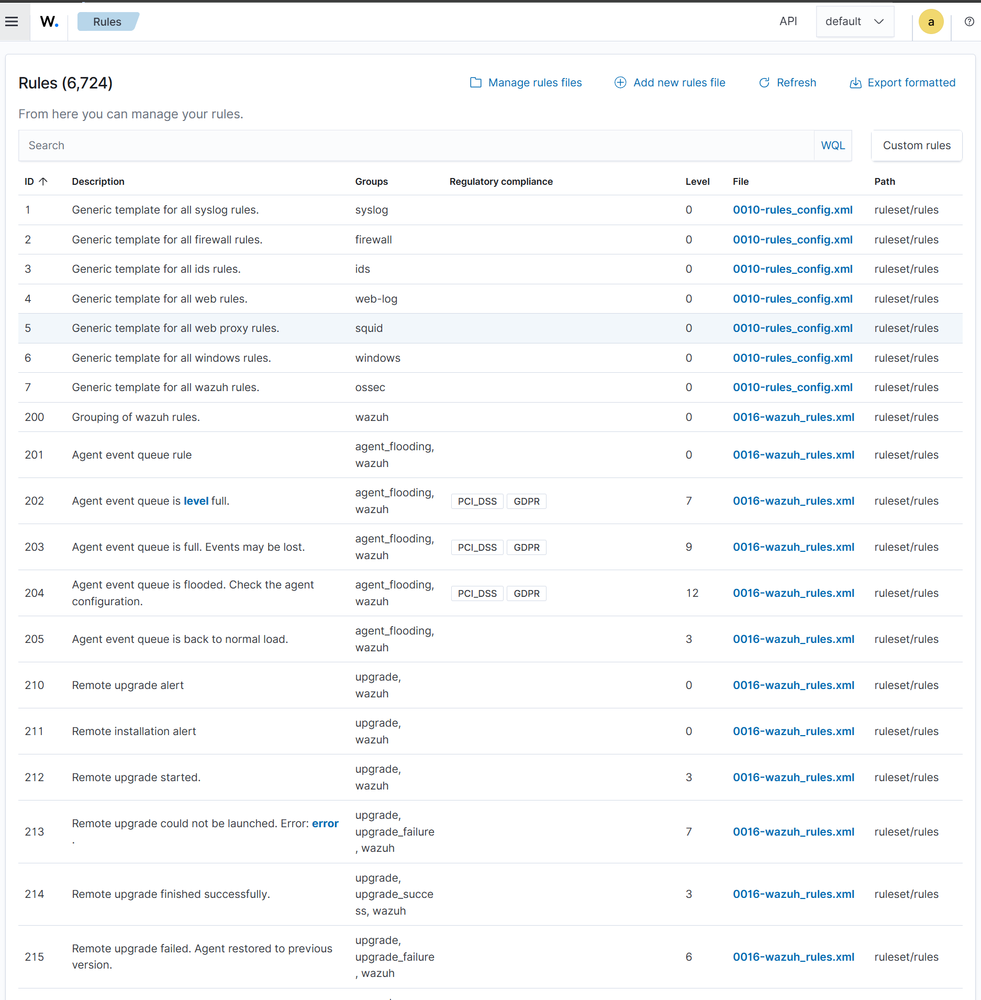

---

## 10. Verification Checklist

Use the following checklist to confirm the Part 4 deployment is operational:

- Wazuh Manager package is installed successfully.
- wazuh-manager service is enabled and running.
- Graylog Raw/Plaintext TCP input is created and listening on port 5555.
- Fluent Bit is installed on the Wazuh Manager.
- Fluent Bit output points to Graylog at 192.168.71.101:5555.
- Graylog input shows transferred data from the Wazuh Manager.
- Raw Wazuh messages are visible in Graylog.
- Wazuh Dashboard wazuh.yml points to the Wazuh Manager.
- Agent registration password is enabled and authd.pass permissions are set.
- Vulnerability detection is enabled or verified based on the installed Wazuh version.
- Linux and Windows agent group configurations are created.
- Optional SOCFortress rules are inspected before being applied.

---

## 11. Observations and Notes

### 11.1 Filebeat Is Not Used in This Architecture

This deployment intentionally avoids Filebeat because events are being forwarded to Graylog instead of directly to the Wazuh Indexer. Fluent Bit reads the Wazuh alert output and sends it to the Graylog TCP input.

### 11.2 TLS Should Be Enabled for Production Graylog Inputs

The lab uses an unencrypted Raw/Plaintext TCP input for simplicity. In production, TLS should be enabled so Wazuh event data is protected in transit.

### 11.3 Raw Messages Need Parsing in Later Parts

The first Graylog verification showed Wazuh messages arriving as single raw blocks. This is expected at this stage. Later parsing, extractors, or pipelines will be needed to split events into searchable fields.

### 11.4 Agent Registration Should Not Remain Open

Leaving agent registration without a password allows any reachable agent to attempt registration. Enabling authd.pass reduces that risk and makes onboarding more controlled.

### 11.5 Third-Party Rules Require Collision Checks

The SOCFortress rule installation script should not be run blindly in an environment with existing custom rules. Duplicate IDs or conflicting rules can prevent Wazuh Manager from starting.

---

## 12. Conclusion

Part 4 deployed the Wazuh Manager Server, connected it to the existing Graylog deployment using Fluent Bit, verified that Wazuh events were reaching Graylog, and connected the Wazuh Dashboard to the manager. The document also preserved the manager hardening steps, vulnerability detection configuration, Linux and Windows agent group policies, and the optional SOCFortress detection rule workflow.

At the end of this part, the SIEM HomeLab has a functional Wazuh Manager integrated with Graylog and ready for agent onboarding, event parsing, rule tuning, and further dashboarding in later parts of the series.
