# SIEM HomeLab — Part 6: Graylog Extractors, Streams, and Wazuh Alert Routing

| Field | Details |
|---|---|
| **Author** | Nimish Sood |
| **Project** | SIEM HomeLab Project |
| **Lab Type** | Cybersecurity / SIEM Homelab |
| **Platform** | VMware Workstation • Wazuh • Graylog • Fluent Bit |
| **Date** | May 2026 |
| **Series** | SIEM HomeLab - Wazuh + Graylog + Grafana |
| **Category** | Cybersecurity |
| **Component** | Graylog Extractors, Streams, and Wazuh Alert Routing |

---

## Table of Contents

1. [Introduction](#1-introduction)
2. [Starting State and Parsing Problem](#2-starting-state-and-parsing-problem)
3. [Configure the Graylog JSON Extractor](#3-configure-the-graylog-json-extractor)
4. [Create a Dedicated Wazuh Alert Index Set](#4-create-a-dedicated-wazuh-alert-index-set)
5. [Configure a Graylog Stream for Wazuh Alerts](#5-configure-a-graylog-stream-for-wazuh-alerts)
6. [Add a Static Routing Field to the Fluent Bit Input](#6-add-a-static-routing-field-to-the-fluent-bit-input)
7. [Build and Run the Stream Rule](#7-build-and-run-the-stream-rule)
8. [Design Notes and Future Routing Considerations](#8-design-notes-and-future-routing-considerations)
9. [Verification Checklist](#9-verification-checklist)
10. [Observations and Notes](#10-observations-and-notes)
11. [Conclusion](#11-conclusion)

---

## 1. Introduction

### 1.1 Lab Overview

This document covers Part 6 of the SIEM HomeLab series. Part 4 configured the Wazuh Manager to write alerts to `alerts.json` and forward those alerts into Graylog through Fluent Bit. Part 5 deployed Wazuh agents and added endpoint telemetry sources. Part 6 focuses on making the Wazuh alert data usable inside Graylog by parsing the raw JSON, creating a dedicated Wazuh alert index set, and routing Wazuh events through a Graylog stream.

The raw Part 6 notes captured the actual lab workflow: the initial unparsed Graylog messages, the JSON extractor configuration, extractor validation, a generated SSH login alert test, index set planning, the change from legacy size-based rotation to Data Tiering, stream creation, static field routing, stream rule creation, and final routing verification.

> **Note:** Every screenshot, configuration value, troubleshooting note, correction, and technical observation from my raw Part 6 notes is preserved and integrated into this professional version. Incorrect or superseded plans are retained and clearly marked rather than silently removed.

### 1.2 Objective of Part 6

The main objective is to turn Wazuh alerts arriving in Graylog from raw single-field messages into normalized, searchable fields that can be used for dashboards, investigations, and future threat-intelligence workflows. A second objective is to keep Wazuh alert storage separate from other log types so that retention, search patterns, and routing can be managed cleanly.

Part 6 completes the following objectives:

- Parse incoming Wazuh JSON alert messages with a Graylog JSON extractor.
- Confirm that Wazuh alert fields are extracted into key/value pairs.
- Create a dedicated Wazuh alert index set using the prefix `wazuh-alerts-nimish`.
- Use Graylog Data Tiering instead of the older legacy rotation approach.
- Create a Wazuh Alerts stream and remove matching events from the default stream.
- Add a static `log_type` field to the Fluent Bit input so Wazuh logs can be routed reliably.
- Create and enable a stream rule that routes `log_type=wazuh` events into the Wazuh alert index set.

### 1.3 Part 6 Workflow Summary

| Phase | Purpose |
|---|---|
| Parse | Use the Graylog JSON extractor to split the Wazuh alert JSON message into searchable fields. |
| Index | Store Wazuh alerts in a dedicated index set with a clear prefix and retention window. |
| Route | Use a static field and stream rule so Wazuh events are routed into the correct index set. |
| Verify | Generate a test alert and confirm the event lands in the `wazuh-alerts-nimish_0` index. |

---

## 2. Starting State and Parsing Problem

### 2.1 Existing Wazuh-to-Graylog Flow

At the beginning of Part 6, the SIEM pipeline from Part 4 was already functioning. The Wazuh Manager was writing alerts to the Wazuh `alerts.json` file, and Fluent Bit was transmitting those alerts to Graylog. That confirmed ingestion, but it did not yet provide useful field normalization in Graylog.

| Component | Role in the Current Pipeline |
|---|---|
| Wazuh Manager | Analyzes endpoint events and writes matching alerts to `alerts.json`. |
| Fluent Bit | Reads Wazuh alert output and forwards it to Graylog over the existing input on port `5555`. |
| Graylog | Receives the event data but initially stores the incoming JSON as one raw `message` field. |
| Part 6 configuration | Adds extraction, indexing, and stream-based routing for Wazuh alerts. |

### 2.2 Raw Graylog Message State

The first issue was that incoming Wazuh alerts were visible in Graylog, but the message body was still not parsed the way it needed to be. There was effectively one main `message` field containing the JSON payload. There was no clean JSON block expanded into individual key/value fields, which made dashboarding, filtering, and future threat-intelligence work much harder.

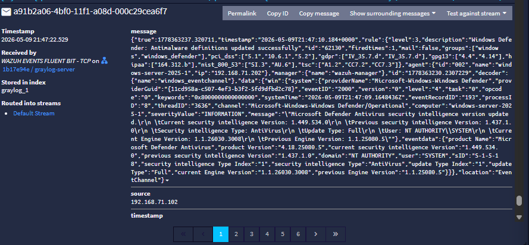

> **Technical observation:** Ingestion and parsing are separate problems. At this stage, Graylog was receiving data successfully, but the event structure was not normalized into usable fields.

---

## 3. Configure the Graylog JSON Extractor

### 3.1 Why a JSON Extractor Was Used

Wazuh writes alert output as JSON, so a Graylog JSON extractor is the most direct way to turn the raw alert payload into searchable Graylog fields. The extractor parses the JSON message and creates fields from the keys in the alert payload. This gives the lab a cleaner foundation for dashboards, investigations, and future enrichment.

> **Design decision:** The extractor was configured with the condition **Always try to extract** because the data arriving from the Wazuh Fluent Bit input is expected to be Wazuh JSON alert data.

### Step 1 — Open the Message Actions Menu and Create an Extractor

From the Graylog search view, click the `message` field for a Wazuh alert. The message actions menu includes **Create extractor**. This is the entry point used to build the JSON extractor against the current input.

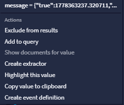

### Step 2 — Configure the JSON Extractor

The extractor was configured as a JSON extractor. The following settings were preserved from the raw notes and are the key configuration values used for the parser:

| Extractor Setting | Value Used | Reason / Effect |
|---|---|---|
| List item separator | `,` | Separates list items inside extracted values. |
| Key separator | `_` | Uses underscores between words in generated field names, for example `data_source_ip`. |
| Key/value separator | `:` | Separates keys from values in the JSON structure. |
| Condition | `Always try to extract` | Used because this input is expected to receive Wazuh JSON alert data from Fluent Bit. |

The compact settings summary from the raw notes was:

```text
List Item Separator = ,
Key Separator = _
Key/value separator = :
Condition = Always try to extract
```

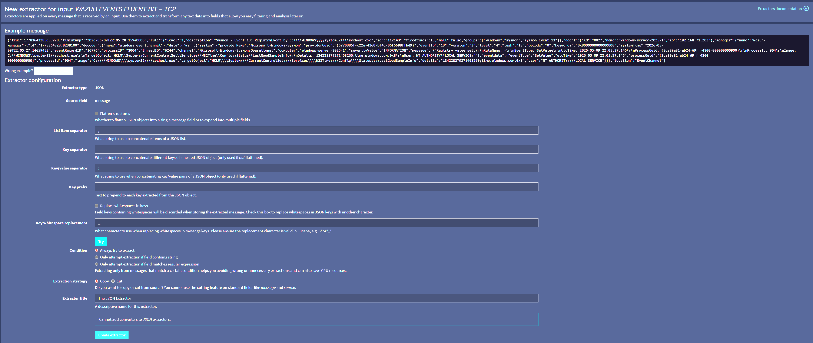

### Step 3 — Test the Extractor Output

After the extractor was configured, the extractor test showed that fields were being successfully extracted from the Wazuh JSON payload. This confirmed that the JSON was being parsed into individual Graylog fields instead of remaining as one raw message block.

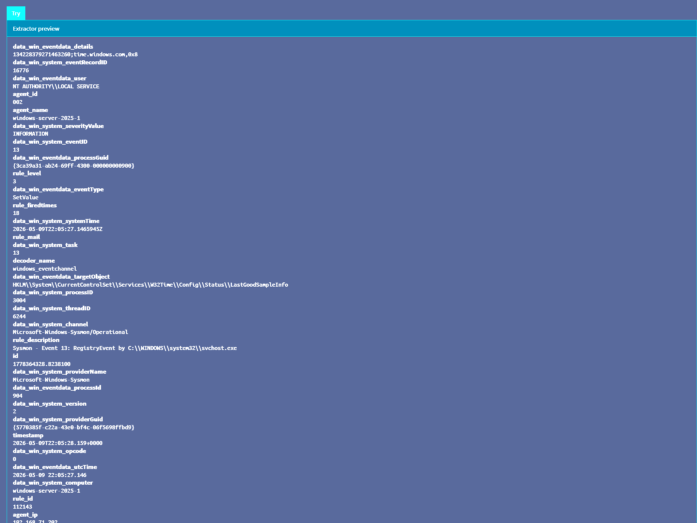

> **Result:** The extractor produced normalized fields that can be filtered, searched, and used for dashboard widgets. This is what makes searches such as source-IP-based filtering practical later.

### 3.2 Validate Parsing with a New Wazuh Alert

After creating the extractor, the next validation step was to return to the Graylog search/stream view, generate a fresh Wazuh alert, and inspect the resulting event. The raw notes used an SSH login on the Wazuh Manager as the test activity. This generated a new alert that could be reviewed in Graylog after extraction was enabled.

> **Test action preserved from raw notes:** An SSH login was performed on the Wazuh Manager to generate a fresh alert for extractor validation.

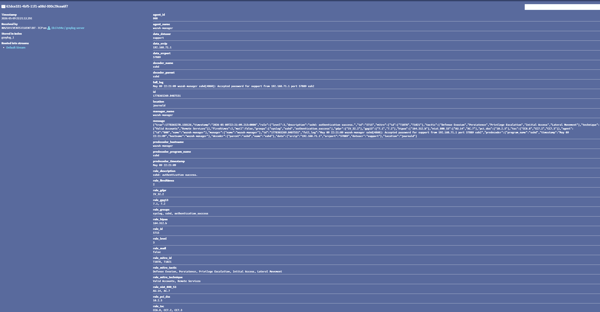

At this point, the lab could begin building more useful dashboards and searches because the Wazuh alert data was no longer trapped inside a single raw message field.

### 3.3 Reusable Pattern for Other Log Sources

The same general approach can be reused for third-party services or devices, such as firewall logs, as long as the message structure is understood and the right parser or extractor is used. For Wazuh alerts, JSON extraction works cleanly because the Wazuh alert file is already JSON.

---

## 4. Create a Dedicated Wazuh Alert Index Set

### 4.1 Why Wazuh Alerts Need Their Own Index Set

After parsing was working, the next goal was to keep Wazuh alert data separated from the rest of the Graylog logs. A dedicated index set makes retention, search patterns, routing, and future visualization cleaner. It also prevents unrelated log sources from mixing with Wazuh alert data in the same storage path.

The dedicated index set created for this lab was named **WAZUH ALERTS**. The selected index prefix was `wazuh-alerts-nimish`.

| Setting | Value |
|---|---|
| Index set name | `WAZUH ALERTS` |
| Index prefix | `wazuh-alerts-nimish` |

### 4.2 Index Prefix and Search Pattern Planning

The index prefix determines the names of the indices created by Graylog in the search backend. With the prefix `wazuh-alerts-nimish`, Graylog can create indices with names like the following:

```text
wazuh-alerts-nimish_0
wazuh-alerts-nimish_1
wazuh-alerts-nimish_2
```

This naming convention also makes later searches and visualizations easier. Instead of pointing tools such as Grafana, OpenSearch Dashboards, or Kibana-style interfaces at one specific backing index, the search pattern can include all current and older Wazuh alert indices:

```text
wazuh-alerts-nimish*
```

> **Design decision:** The prefix was intentionally specific to Wazuh alerts so future log sources, such as Office 365 or firewall logs, can use separate prefixes, retention policies, and dashboards.

### 4.3 Rotation Plan Correction: Legacy Size Rotation Replaced by Data Tiering

The original plan was to use Graylog legacy rotation and rotate the Wazuh alert index when it reached approximately 10 GB. The reasoning was sound: avoid one large index growing forever and keep the data organized. However, during the setup, the lab notes recorded that Graylog had moved away from the older legacy rotation workflow and that Data Tiering was the newer recommended path in the interface being used.

> **Correction:** The original 10 GB legacy size-based rotation plan was not used in the final configuration. It was replaced with Graylog Data Tiering using a hot tier and a time-based retention window.

For this HomeLab, a simple hot-tier retention design is enough. The goal is to keep recent Wazuh alerts searchable for testing, troubleshooting, and short-term review without overcomplicating the storage architecture or wasting disk space.

| Retention Setting | Value |
|---|---|
| Minimum lifetime | 7 days |
| Maximum lifetime | 14 days |

With this configuration, Graylog should keep Wazuh alert indices for at least 7 days but no longer than 14 days before removal based on the Data Tiering retention policy. This is a better fit for the current lab than the original 10 GB plan because the retention requirement is based on how long the data is useful, not only on how large the index becomes.

Shard and replica settings were intentionally kept simple. Since this is not a large production cluster, the plan is to start with defaults where possible, monitor disk usage and search performance, and tune later only if there is a real operational reason.

### Step 4 — Start the Index Set Creation Workflow

The index set creation workflow was opened in Graylog so the new **WAZUH ALERTS** index set could be created for Wazuh alert storage.

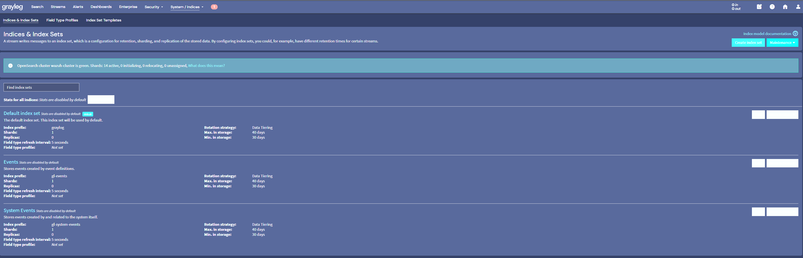

### Step 5 — Configure the WAZUH ALERTS Index Set

The **WAZUH ALERTS** index set was configured with the `wazuh-alerts-nimish` prefix and the Data Tiering retention plan described above. The original size-based rotation idea remained useful for planning the separation of Wazuh data, but the final implementation used the newer retention model available in Graylog.

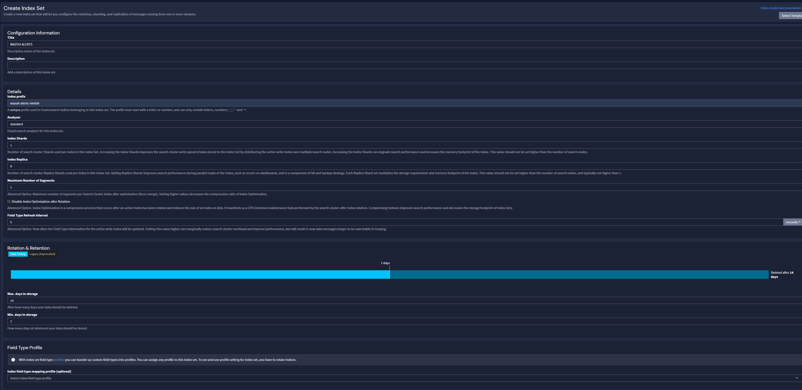

### Step 6 — Verify the New Index Set Exists

After saving the configuration, the newly created **WAZUH ALERTS** index set appeared in the Graylog index set list. This confirmed that the storage target for routed Wazuh alerts was available.

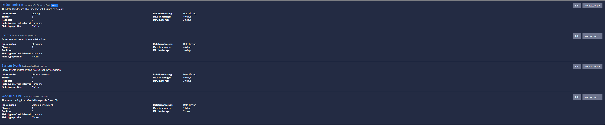

---

## 5. Configure a Graylog Stream for Wazuh Alerts

### 5.1 Why Streams Were Needed

Graylog streams allow incoming messages to be routed based on rules. This is useful when different log sources need different storage locations, retention policies, or access patterns. In this lab, the Wazuh alerts should go to the **WAZUH ALERTS** index set instead of remaining mixed with the default stream.

The same pattern can be used later for firewall logs, Office 365 logs, or tenant-specific data. For example, Wazuh logs can use one retention policy while firewall logs or Office 365 logs can use another.

> **Technical note:** Separating log sources also helps reduce field-growth problems. The raw notes specifically called out the Elastic-style 1000-field mapping limit concern. Keeping Wazuh, Office 365, and other high-field-count sources separate reduces the chance that one source pollutes or overloads another source's mapping space.

### Step 7 — Create the Wazuh Alerts Stream

A new stream was created for Wazuh alerts. The stream was configured to route matching messages to the newly created **WAZUH ALERTS** index set. The option **Remove matches from default stream** was enabled so matching Wazuh events would not also remain in the default stream.

| Stream Setting | Value / Behavior |
|---|---|
| Stream name | `Wazuh Alerts` |
| Target index set | `WAZUH ALERTS` |
| Remove matches from default stream | Enabled |
| Initial state | Paused until stream rules are created and the stream is started |

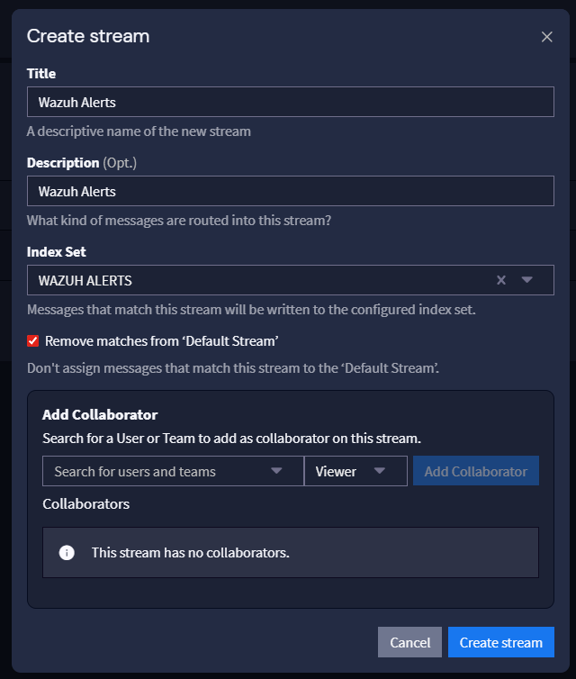

> **Important:** A newly created stream is paused by default. A stream rule must be added before it can be safely started and used for routing.

---

## 6. Add a Static Routing Field to the Fluent Bit Input

### 6.1 Routing Design

The stream needed a reliable field to match against. Since all Wazuh alerts were arriving through the existing Fluent Bit input on port `5555`, a static field was added at the input level. This means Graylog adds the same field to every message received through that input.

| Static Field | Value |
|---|---|
| `log_type` | `wazuh` |

This field becomes the routing marker used by the Wazuh Alerts stream rule. Instead of relying on a field that may or may not exist inside a specific Wazuh alert, the lab uses a predictable Graylog-added field that identifies the log source.

### Step 8 — Add the Static Field in System > Inputs

In Graylog, navigate to **System > Inputs** and edit the existing input receiving Fluent Bit data on port `5555`. Add the static field with the name `log_type` and the value `wazuh`.

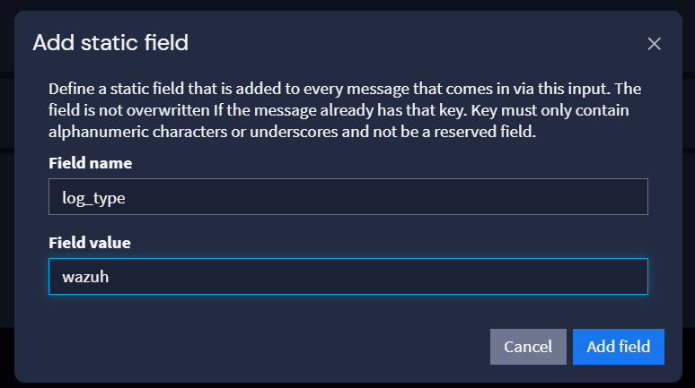

After saving the static field, the input showed `log_type: wazuh` as part of the input configuration. This confirms that Graylog will attach the field to incoming Wazuh messages received through that input.

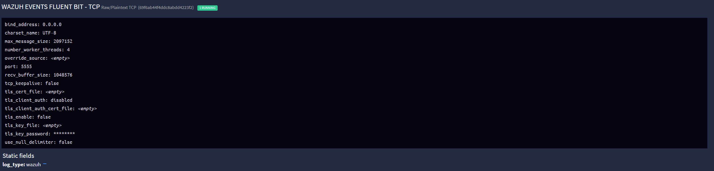

### 6.2 Confirm the Static Field Appears on New Messages

A new log message was then reviewed to confirm that the static field was being added to incoming events. The `log_type` field was visible in the message, which confirmed that the stream would have a reliable field to match.


---

## 7. Build and Run the Stream Rule

### 7.1 Create the Stream Rule

After the static field was confirmed, a stream rule was added to the Wazuh Alerts stream. The rule matches messages where `log_type` is exactly `wazuh`.

```text
Field: log_type
Type: match exactly
Value: wazuh
```

| Rule Field | Configured Value |
|---|---|
| Field | `log_type` |
| Type | `match exactly` |
| Value | `wazuh` |

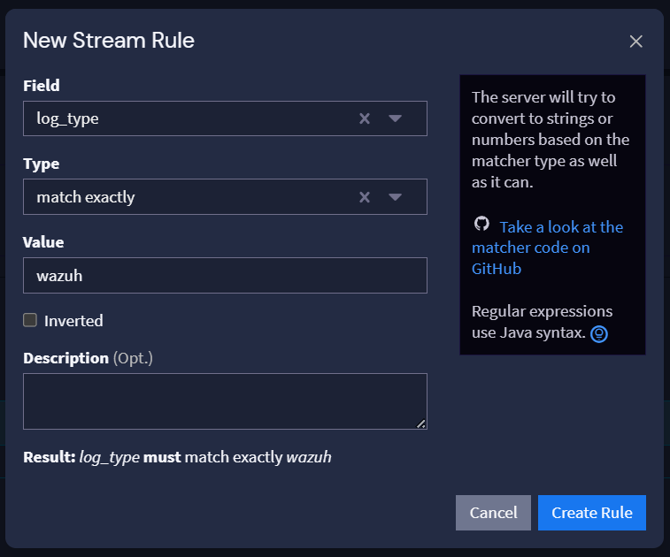

### 7.2 Start the Stream and Verify Routing

With the stream rule in place, the Wazuh Alerts stream was started. After routing was enabled, Wazuh alerts were confirmed in the `wazuh-alerts-nimish_0` index. This verified that the static field, stream rule, and dedicated index set were working together correctly.

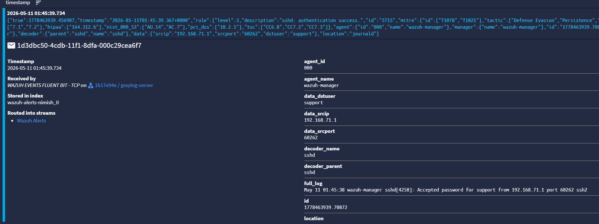

> **Result:** Wazuh alerts are now parsed, tagged with `log_type=wazuh`, routed through the Wazuh Alerts stream, removed from the default stream, and stored in the dedicated `wazuh-alerts-nimish` index set.

---

## 8. Design Notes and Future Routing Considerations

### 8.1 Office 365, Firewall, and Other Future Log Sources

The same stream/index pattern can be reused for other sources. For example, Office 365 logs can be brought into Graylog and stored in a separate index set instead of mixing them with Wazuh alerts. Firewall logs can also be routed to a separate index set if they need a different retention period or different dashboards.

| Future Source | Recommended Handling |
|---|---|
| Office 365 logs | Use a separate input/static field or parser and route to an Office 365-specific stream and index set. |
| Firewall logs | Use source-specific parsing and route to a firewall-specific stream and index set. |
| Wazuh alerts | Keep in **WAZUH ALERTS** using the `wazuh-alerts-nimish` prefix and the current retention policy. |
| Multi-tenant logs | Separate by tenant, source, or retention requirement so one source does not affect another. |

### 8.2 Field Growth and Mapping Control

The raw notes specifically called out a recommendation to keep sources such as Office 365 separate from Wazuh logs because high numbers of unique key/value fields can create performance and mapping-management problems. Examples of extracted Wazuh-style fields include `agent_ip` and `data_agent_name`. In Elastic/OpenSearch-style backends, excessive unique fields can lead to field mapping growth and slower searches.

> **Technical note:** The point is not that 1000 is a magic design target for every environment. The practical lesson is to avoid field explosion by separating major log sources, controlling extraction, and monitoring mapping growth.

### 8.3 Why the Static Field Pattern Is Useful

The `log_type=wazuh` static field is simple, but it is reliable. It avoids depending on inconsistent payload fields and makes routing easy to understand. If a future source has its own input, it can receive a different static field such as `log_type=firewall` or `log_type=o365`. Graylog streams can then route each source to the correct index set.

---

## 9. Verification Checklist

| Validation Item | Status |
|---|---|
| Raw Wazuh alerts were visible in Graylog before parsing | Completed |
| Problem identified: Wazuh alerts were arriving as one raw message field | Completed |
| Create extractor workflow opened from the Graylog message field menu | Completed |
| JSON extractor configured for Wazuh alert messages | Completed |
| Extractor settings preserved: list item separator, key separator, key/value separator, and Always try to extract condition | Completed |
| Extractor test showed Wazuh fields successfully extracted | Completed |
| Fresh SSH login alert generated on the Wazuh Manager and reviewed in Graylog | Completed |
| Dedicated WAZUH ALERTS index set planned and created | Completed |
| Index prefix `wazuh-alerts-nimish` preserved | Completed |
| Search pattern `wazuh-alerts-nimish*` documented for future visualization/search usage | Completed |
| Original 10 GB legacy rotation plan preserved and corrected | Completed |
| Final retention design changed to Graylog Data Tiering with 7-day minimum and 14-day maximum lifetime | Completed |
| Wazuh Alerts stream created and associated with the WAZUH ALERTS index set | Completed |
| Remove matches from default stream enabled | Completed |
| Static input field `log_type=wazuh` added to the Fluent Bit input on port `5555` | Completed |
| New messages confirmed to contain `log_type` field | Completed |
| Stream rule created: `log_type` match exactly `wazuh` | Completed |
| Stream started and events confirmed in `wazuh-alerts-nimish_0` | Completed |

---

## 10. Observations and Notes

### 10.1 Parsing Made Wazuh Alerts Useful for Dashboards

Before the extractor, Graylog had the Wazuh alert data but not in a useful normalized format. After the extractor, fields could be used for filtering, searching, and dashboard development. This is the step that turns basic log ingestion into practical SIEM analysis.

### 10.2 Dedicated Index Sets Keep the SIEM Cleaner

Keeping Wazuh alerts in their own index set makes the lab easier to manage. It also gives future flexibility for different retention periods, source-specific dashboards, and source-specific troubleshooting.

### 10.3 Data Tiering Fit the Lab Better Than the Original Rotation Plan

The original 10 GB rotation idea was useful as a planning point, but the final Data Tiering configuration better matches the current HomeLab requirement. Recent alerts need to remain searchable for a short period, but long-term retention is not necessary at this stage.

### 10.4 Static Input Fields Make Stream Routing Predictable

Adding `log_type=wazuh` at the input level gives the stream rule a stable routing marker. This is cleaner than relying on fields that may differ between alert types or parser versions.

### 10.5 The Pattern Scales to Other Sources

The same approach can be reused for Office 365, firewalls, endpoint telemetry, or multi-tenant inputs. The key is to separate parsing, routing, and storage decisions instead of dumping every source into the same default stream and index set.

---

## 11. Conclusion

Part 6 transformed the Wazuh-to-Graylog ingestion path from raw message storage into a more professional SIEM routing design. Wazuh alerts are now parsed with a Graylog JSON extractor, stored in a dedicated **WAZUH ALERTS** index set using the `wazuh-alerts-nimish` prefix, retained through a simple Data Tiering policy, tagged with `log_type=wazuh` at the input level, routed through a Wazuh Alerts stream, removed from the default stream, and verified in the `wazuh-alerts-nimish_0` index.

At the end of this part, the SIEM HomeLab has a cleaner Graylog foundation for Wazuh alert searches, dashboards, source-specific retention, and future integrations such as Office 365 or firewall log routing.

Next: SIEM HomeLab - Part 7: Dashboarding, Visualization, and Threat Investigation Workflows.
