# SIEM HomeLab — Part 5: Wazuh Agent Deployment and Endpoint Telemetry

| Field | Details |
|---|---|
| **Author** | Nimish Sood |
| **Project** | SIEM HomeLab Project |
| **Lab Type** | Cybersecurity / SIEM Homelab |
| **Platform** | VMware Workstation • Debian 12 • Windows Server 2025 |
| **Date** | May 2026 |
| **Series** | SIEM HomeLab - Wazuh + Graylog + Grafana |
| **Category** | Cybersecurity |
| **Component** | Wazuh Agents and Endpoint Telemetry |

---

## Table of Contents

1. [Introduction](#1-introduction)
2. [Lab Environment](#2-lab-environment)
3. [Verify Wazuh Manager Agent Ports](#3-verify-wazuh-manager-agent-ports)
4. [Deploy the Debian 12 Wazuh Agent](#4-deploy-the-debian-12-wazuh-agent)
5. [Deploy the Windows Server 2025 Wazuh Agent](#5-deploy-the-windows-server-2025-wazuh-agent)
6. [Extend Windows Telemetry with Sysmon](#6-extend-windows-telemetry-with-sysmon)
7. [Configure the Windows Wazuh Group to Collect Sysmon Events](#7-configure-the-windows-wazuh-group-to-collect-sysmon-events)
8. [Validate Windows Telemetry and Troubleshoot Wazuh Manager](#8-validate-windows-telemetry-and-troubleshoot-wazuh-manager)
9. [Configure Packetbeat on the Debian 12 Endpoint](#9-configure-packetbeat-on-the-debian-12-endpoint)
10. [Configure the Linux Wazuh Group to Collect Packetbeat Output](#10-configure-the-linux-wazuh-group-to-collect-packetbeat-output)
11. [Verification Checklist](#11-verification-checklist)
12. [Observations and Notes](#12-observations-and-notes)
13. [Conclusion](#13-conclusion)

---

## 1. Introduction

### 1.1 Lab Overview

This document covers Part 5 of the SIEM HomeLab series. Part 3 deployed the Graylog Server, and Part 4 deployed the Wazuh Manager Server and prepared Linux and Windows agent groups. Part 5 deploys Wazuh agents onto a Debian 12 host and a Windows Server 2025 host, then extends endpoint telemetry with Sysmon on Windows and Packetbeat on Debian 12.

The raw Part 5 notes captured the real lab process: successful commands, mistakes, failed service starts, stale Sysmon event log registration, missing package prerequisites, permission mistakes, screenshots, and later fixes. Those details are retained here and reorganized into a professional deployment guide.

> **Note:** Every screenshot, command, configuration block, error, troubleshooting step, correction, and technical observation from my raw Part 5 notes is preserved and integrated into this professional version. Incorrect attempts are retained and clearly marked rather than silently removed.

### 1.2 What the Wazuh Agent Does

The Wazuh agent is the endpoint-side component that sends endpoint telemetry to the Wazuh Manager. It can collect operating system logs, Windows Event Channel logs, local files, command output, system inventory, file integrity monitoring results, vulnerability data, and other endpoint signals depending on configuration.

The biggest benefit in this lab is endpoint log collection. File integrity monitoring is useful, but it can increase resource consumption depending on the number of monitored paths and scan frequency. For that reason, agent policy should be tuned instead of blindly enabling every feature at maximum depth.

The basic Wazuh agent installation is straightforward because the Wazuh Dashboard can generate a single-line install command for each endpoint. In practice, the agent can also be bundled with additional tools such as Sysmon or Packetbeat through a deployment script.

### 1.3 Agent Registration and Log Flow

The agent first registers with the Wazuh Manager on TCP port 1515. In Part 4, agent registration was protected using password authentication. Certificate-based registration is also possible, but this lab used the registration password workflow.

When the manager approves registration, it generates a client key and provides it to the agent. The manager and the agent both retain a copy of that symmetric key, which is then used for encrypted agent-manager communication. After registration completes, port 1515 is no longer the active log transport path; operational event traffic flows to the Wazuh Manager on TCP port 1514.

> **Important:** If a firewall exists between agents and the manager, allow both TCP 1515 for enrollment and TCP 1514 for agent event traffic. Blocking either path can lead to confusing behavior where an agent registers but never sends logs, or cannot register at all.

---

## 2. Lab Environment

### 2.1 Endpoint Hosts Used in Part 5

| Role | Details |
| --- | --- |
| Wazuh Manager | wazuh-manager at 192.168.71.102. Agent registration on TCP 1515 and event traffic on TCP 1514. |
| Linux endpoint | Debian 12 host named debian12-1 at 192.168.71.201. This host receives the Linux Wazuh agent and Packetbeat. |
| Windows endpoint | Windows Server 2025 Standard VM named windows-server-2025-1 at 192.168.71.202. This host receives the Windows Wazuh agent and Sysmon. |
| Wazuh Dashboard | Used to generate agent deployment commands and edit agent group configuration. |

### 2.2 Windows Server 2025 Virtual Machine Specification

| Setting | Value |
| --- | --- |
| Name | windows-server-2025-1 |
| Operating system | Windows Server 2025 Standard |
| Processors | 4 CPU cores |
| RAM | 8 GB |
| Disk | 60 GB |
| IP address | 192.168.71.202 |

---

## 3. Verify Wazuh Manager Agent Ports

### Step 1 — Confirm authd and remoted are Listening

Before deploying agents, the Wazuh Manager was checked to confirm that both registration and log collection ports were listening.

```bash
ss -ltnpd | grep wazuh
```

The screenshot shows two important manager-side processes: wazuh-authd listening on TCP 1515 and wazuh-remoted listening on TCP 1514. wazuh-authd handles registration and key exchange, while wazuh-remoted receives operational agent logs after enrollment.

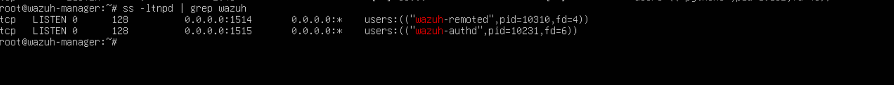

---

## 4. Deploy the Debian 12 Wazuh Agent

### Step 2 — Generate the Linux Agent Command in the Wazuh Dashboard

The first agent was deployed to the Debian 12 endpoint named debian12-1. In the Wazuh Dashboard, navigate to Agent Management > Deploy New Agent, select the Linux DEB package, set the manager address, and assign the Linux group created in Part 4.

| Field | Value Used |
| --- | --- |
| Agent name | debian12-1 |
| Agent operating system | Debian 12 |
| Agent IP address | 192.168.71.201 |
| Manager address | 192.168.71.102 |
| Group | linux |

> **Note:** Using a hostname or FQDN for the manager address is recommended in production. This lab used the raw IP address 192.168.71.102 for simplicity and consistency across the lab network.

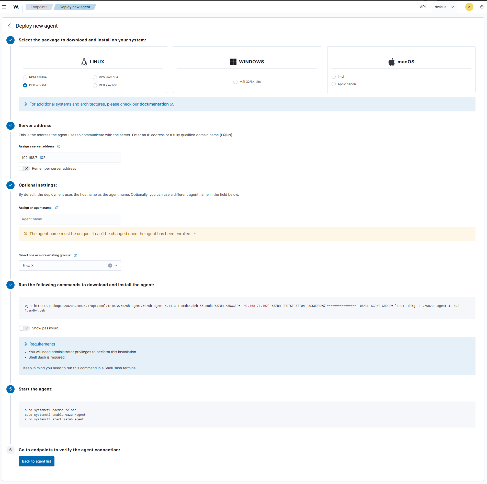

The Dashboard-generated Linux installation command was:

```bash
wget https://packages.wazuh.com/4.x/apt/pool/main/w/wazuh-agent/wazuh-agent_4.14.3-1_amd64.deb && sudo WAZUH_MANAGER='192.168.71.102' WAZUH_REGISTRATION_PASSWORD=$'***************' WAZUH_AGENT_GROUP='linux' dpkg -i ./wazuh-agent_4.14.3-1_amd64.deb
```

---

### Step 3 — Run the Linux Agent Installer on debian12-1

The deployment command was copied from the Wazuh Dashboard and run from the Debian 12 endpoint. The raw terminal capture preserved the lab registration password in clear text.

> **Security note:** The visible password in this lab command is preserved because it appears in the original raw notes. Treat it as a lab-only credential and rotate it before publishing or reusing this environment.

```bash
wget https://packages.wazuh.com/4.x/apt/pool/main/w/wazuh-agent/wazuh-agent_4.14.3-1_amd64.deb && sudo WAZUH_MANAGER='192.168.71.102' WAZUH_REGISTRATION_PASSWORD=$'Pleaseregister1!' WAZUH_AGENT_GROUP='linux' dpkg -i ./wazuh-agent_4.14.3-1_amd64.deb
```

The terminal output confirmed that the Wazuh package was downloaded and installed. The package shown in the output was wazuh-agent 4.14.3-1. The file was saved as wazuh-agent_4.14.3-1_amd64.deb.1 because a copy already existed on the host.

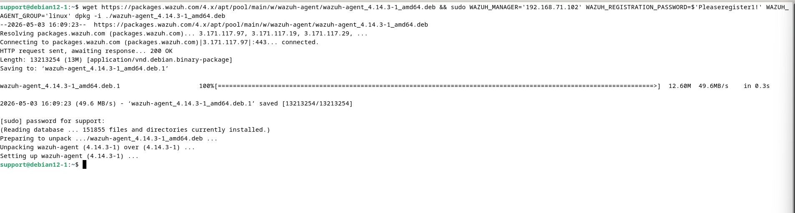

After installation, the Wazuh agent service must be enabled and started:

```bash
sudo systemctl daemon-reload
sudo systemctl enable wazuh-agent
sudo systemctl start wazuh-agent
```

---

### Step 4 — Verify the Debian Agent in the Wazuh Web UI

After enrollment, the Debian agent appeared in the Wazuh web interface. The captured screenshot shows the agent object present with the name debian12-1 and the linux group. At that moment it was still marked never connected, which can happen before the service finishes starting or before the first successful heartbeat reaches the manager.

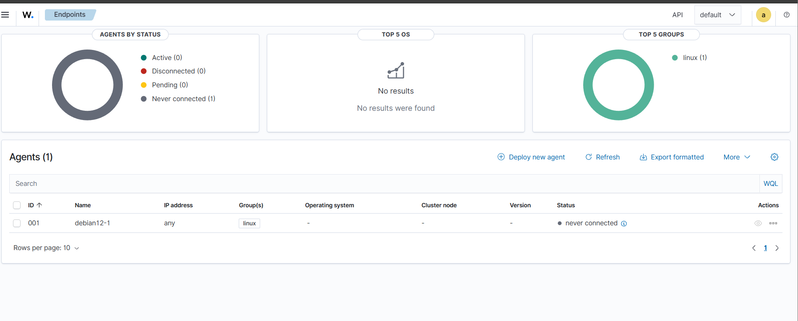

---

## 5. Deploy the Windows Server 2025 Wazuh Agent

### Step 5 — Create the Windows Server 2025 Endpoint VM

A Windows Server 2025 Standard virtual machine was created as the second monitored endpoint. The VM was placed under the Agent VMs directory and configured with NAT networking for the lab.

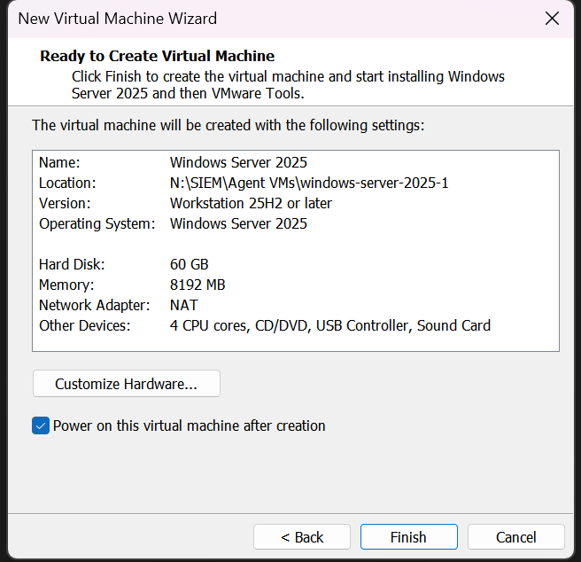

---

### Step 6 — Generate the Windows Agent Command in the Wazuh Dashboard

The same Wazuh Dashboard deployment workflow was used for Windows. The Windows MSI package was selected, the manager address was set to 192.168.71.102, and the endpoint was assigned to the windows group created in Part 4.

| Field | Value Used |
| --- | --- |
| Agent name | windows-server-2025-1 |
| Agent operating system | Windows Server 2025 Standard |
| Agent IP address | 192.168.71.202 |
| Manager address | 192.168.71.102 |
| Group | windows |

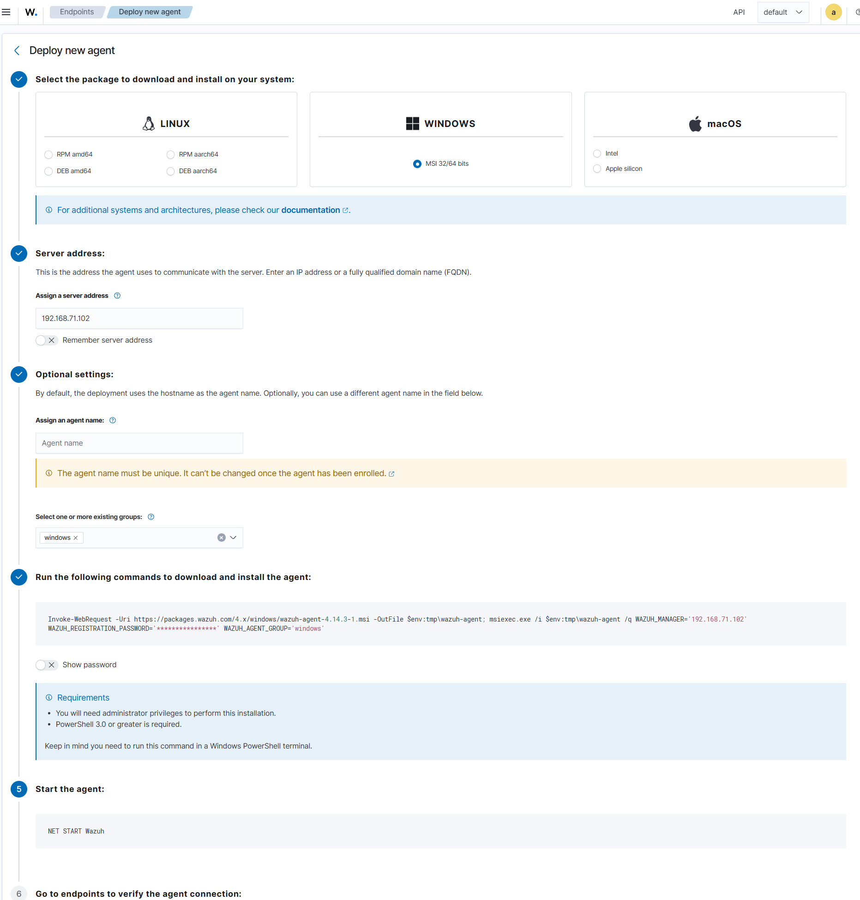

The Dashboard-generated Windows installation command was:

```powershell
Invoke-WebRequest -Uri https://packages.wazuh.com/4.x/windows/wazuh-agent-4.14.3-1.msi -OutFile $env:tmp\wazuh-agent; msiexec.exe /i $env:tmp\wazuh-agent /q WAZUH_MANAGER="192.168.71.102" WAZUH_REGISTRATION_PASSWORD="***************" WAZUH_AGENT_GROUP="windows"
```

---

### Step 7 — Run the Windows Agent Installer as Administrator

The Windows deployment command was run from an Administrator PowerShell session. After the MSI installation command completed, the Wazuh service was started manually with NET START Wazuh.

```powershell
Invoke-WebRequest -Uri https://packages.wazuh.com/4.x/windows/wazuh-agent-4.14.3-1.msi -OutFile $env:tmp\wazuh-agent; msiexec.exe /i $env:tmp\wazuh-agent /q WAZUH_MANAGER="192.168.71.102" WAZUH_REGISTRATION_PASSWORD="Pleaseregister1!" WAZUH_AGENT_GROUP="windows"
NET START Wazuh
```

The terminal output confirmed: The Wazuh service is starting. The Wazuh service was started successfully.

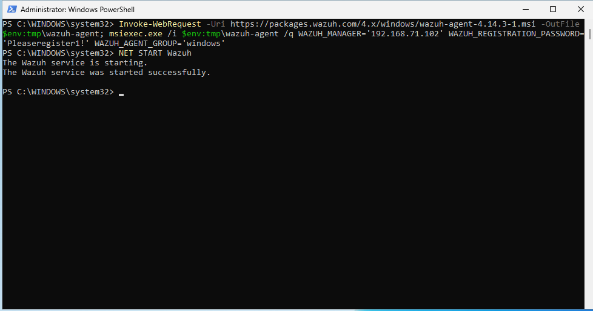

---

### Step 8 — Verify Both Agents in the Wazuh Web UI

The endpoint list then showed two agents: debian12-1 and windows-server-2025-1. The Debian endpoint was active with Debian GNU/Linux 12 and Wazuh agent version v4.14.3. The Windows agent was visible but still marked never connected in the captured screenshot, meaning the object had been created but the UI had not yet shown an active agent heartbeat.

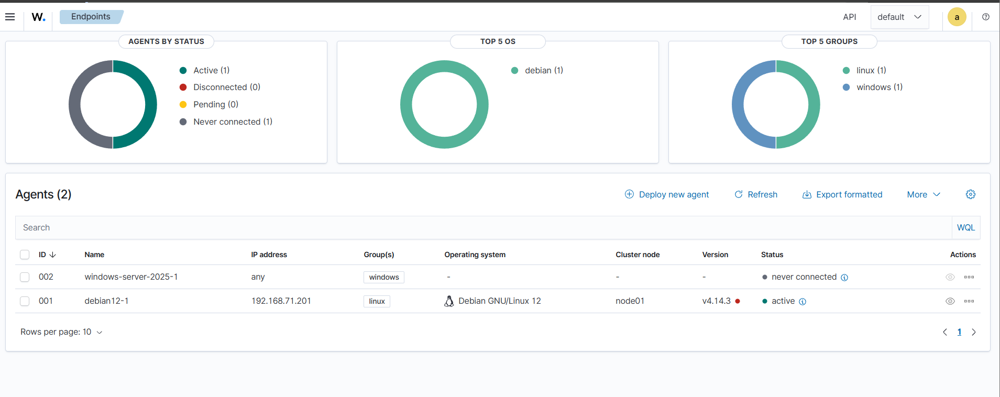

---

## 6. Extend Windows Telemetry with Sysmon

### 6.1 Why Sysmon Was Added

By default, the Wazuh agent alone does not collect every Windows telemetry source needed for deeper endpoint detection. The raw notes specifically called out missing visibility into network connections and PowerShell process activity. To move closer to an EDR-style signal set, Sysmon was installed on the Windows Server 2025 endpoint and Wazuh was later configured to collect the Sysmon Event Channel.

Sysmon writes detailed telemetry to the following Event Viewer path:

```text
Applications and Services Logs > Microsoft > Windows > Sysmon > Operational
```

### 6.2 Objective

After installing the Wazuh agent on the Windows Server 2025 endpoint, Sysmon was installed to generate richer Windows telemetry. These Sysmon events can later be collected by Wazuh through a Windows Event Channel localfile block.

---

### Step 9 — Initial Problem: Sysmon Was Downloaded but Not Installed

The Sysinternals folder was downloaded successfully, but Sysmon was not installed as a Windows service. The following command confirmed that the Sysmon64 service did not exist:

```powershell
Get-Service Sysmon64
```

The result showed:

```text
Cannot find any service with service name 'Sysmon64'.
```

This proved that downloading Sysinternals did not equal installing Sysmon as a service.

---

### Step 10 — Download Sysmon and the Olaf Hartong Sysmon Configuration

A clean Sysmon download was performed using the official Sysmon ZIP package instead of relying on the full Sysinternals Suite. PowerShell was run as Administrator.

```powershell
$ErrorActionPreference = "Stop"

$SysmonDownloadUrl = "https://download.sysinternals.com/files/Sysmon.zip"
$SysmonConfigUrl   = "https://raw.githubusercontent.com/olafhartong/sysmon-modular/master/sysmonconfig.xml"

$TempRoot          = "C:\Temp\SysmonInstall"
$ExtractPath       = Join-Path $TempRoot "Extracted"
$SysmonZipPath     = Join-Path $TempRoot "Sysmon.zip"
$ConfigPath        = Join-Path $TempRoot "sysmonconfig.xml"

if (Test-Path $TempRoot) {
    Remove-Item $TempRoot -Recurse -Force
}

New-Item -Path $TempRoot -ItemType Directory -Force | Out-Null
New-Item -Path $ExtractPath -ItemType Directory -Force | Out-Null

[Net.ServicePointManager]::SecurityProtocol = [Net.SecurityProtocolType]::Tls12

Invoke-WebRequest `
    -Uri $SysmonDownloadUrl `
    -OutFile $SysmonZipPath `
    -UseBasicParsing

Expand-Archive `
    -Path $SysmonZipPath `
    -DestinationPath $ExtractPath `
    -Force

Invoke-WebRequest `
    -Uri $SysmonConfigUrl `
    -OutFile $ConfigPath `
    -UseBasicParsing

Get-ChildItem $ExtractPath
Get-Item $ConfigPath
```

The working paths used later were:

```powershell
C:\Temp\SysmonInstall\Extracted\Sysmon64.exe
C:\Temp\SysmonInstall\sysmonconfig.xml
```

The Sysmon configuration file downloaded successfully. The raw notes recorded the downloaded configuration size as 253169 bytes.

---

### Step 11 — First Sysmon Installation Attempt and Manifest Failure

Sysmon was first installed using the downloaded XML configuration file:

```powershell
cd C:\Temp\SysmonInstall\Extracted
.\Sysmon64.exe -accepteula -i C:\Temp\SysmonInstall\sysmonconfig.xml
```

The XML configuration itself validated successfully:

```text
Loading configuration file with schema version 4.90
Sysmon schema version: 4.91
Configuration file validated.
```

However, the installation failed with a manifest-related error:

```text
wevtutil.exe returned failure
Event manifest installation failed with last error:
The operation completed successfully.
```

Installing Sysmon without the XML configuration also failed with the same manifest-related error:

```powershell
.\Sysmon64.exe -accepteula -i
```

> **Correction:** This was an incorrect or failed attempt, but it is preserved because it explains why the later cleanup was required.

---

### Step 12 — Confirm Stale Sysmon Event Log Registration

The Sysmon service still did not exist:

```powershell
Get-Service Sysmon64
```

Result:

```text
Cannot find any service with service name 'Sysmon64'.
```

However, the Sysmon Event Log channel still appeared:

```powershell
wevtutil el | findstr /i sysmon
```

Output:

```text
Microsoft-Windows-Sysmon/Operational
```

This confirmed that Windows had stale Sysmon Event Log registration even though Sysmon was not installed as a service.

---

### Step 13 — Run the Working Cleanup Script

The following cleanup block fixed the stale Sysmon registration problem. It removes possible Sysmon services and drivers, tries to unregister the Sysmon manifest, clears the Sysmon Event Log if possible, backs up and deletes stale Event Log registry keys, removes leftover Sysmon binaries and drivers, and renames the stale EVTX file if present.

> **Important:** Run this block in PowerShell as Administrator. The script ends with a clear instruction to reboot before reinstalling Sysmon.

```powershell
# Force cleanup stale Sysmon Event Log registration
# Run as Administrator

$ErrorActionPreference = "Continue"

Write-Host "Stopping/removing possible Sysmon services/drivers..." -ForegroundColor Cyan

sc.exe stop Sysmon64
sc.exe delete Sysmon64
sc.exe stop Sysmon
sc.exe delete Sysmon
sc.exe stop SysmonDrv
sc.exe delete SysmonDrv

Write-Host "`nTrying to unregister Sysmon manifest..." -ForegroundColor Cyan

$PossibleSysmonBinaries = @(
    "C:\Temp\SysmonInstall\Extracted\Sysmon64.exe",
    "C:\Windows\Sysmon64.exe",
    "C:\Program Files\Sysmon\Sysmon64.exe",
    "C:\Program Files\sysinternals\Sysmon64.exe"
)

foreach ($bin in $PossibleSysmonBinaries) {
    if (Test-Path $bin) {
        Write-Host "Trying: wevtutil um $bin"
        wevtutil um "$bin"
        Write-Host "Exit code: $LASTEXITCODE"
    }
}

Write-Host "`nClearing Sysmon event log if possible..." -ForegroundColor Cyan

wevtutil cl "Microsoft-Windows-Sysmon/Operational"
Write-Host "Clear log exit code: $LASTEXITCODE"

Write-Host "`nBacking up stale Event Log registry keys..." -ForegroundColor Cyan

New-Item -Path "C:\Temp\SysmonRegistryBackup" -ItemType Directory -Force | Out-Null

reg.exe export "HKLM\SOFTWARE\Microsoft\Windows\CurrentVersion\WINEVT\Channels\Microsoft-Windows-Sysmon/Operational" "C:\Temp\SysmonRegistryBackup\Sysmon-Channel.reg" /y
reg.exe export "HKLM\SOFTWARE\Microsoft\Windows\CurrentVersion\WINEVT\Publishers\{5770385f-c22a-43e0-bf4c-06f5698ffbd9}" "C:\Temp\SysmonRegistryBackup\Sysmon-Publisher.reg" /y

Write-Host "`nDeleting stale Event Log registry keys..." -ForegroundColor Cyan

reg.exe delete "HKLM\SOFTWARE\Microsoft\Windows\CurrentVersion\WINEVT\Channels\Microsoft-Windows-Sysmon/Operational" /f
reg.exe delete "HKLM\SOFTWARE\Microsoft\Windows\CurrentVersion\WINEVT\Publishers\{5770385f-c22a-43e0-bf4c-06f5698ffbd9}" /f

Write-Host "`nDeleting leftover Sysmon files..." -ForegroundColor Cyan

$Leftovers = @(
    "C:\Windows\Sysmon64.exe",
    "C:\Windows\Sysmon.exe",
    "C:\Windows\SysmonDrv.sys",
    "C:\Windows\System32\drivers\SysmonDrv.sys"
)

foreach ($file in $Leftovers) {
    if (Test-Path $file) {
        Write-Host "Taking ownership of $file"
        takeown.exe /f "$file"
        icacls.exe "$file" /grant Administrators:F

        Write-Host "Deleting $file"
        Remove-Item -Path $file -Force -ErrorAction SilentlyContinue
    }
}

Write-Host "`nRenaming stale Sysmon EVTX file if present..." -ForegroundColor Cyan

$SysmonEvtx = "C:\Windows\System32\winevt\Logs\Microsoft-Windows-Sysmon%4Operational.evtx"

if (Test-Path $SysmonEvtx) {
    takeown.exe /f "$SysmonEvtx"
    icacls.exe "$SysmonEvtx" /grant Administrators:F

    Rename-Item `
        -Path $SysmonEvtx `
        -NewName "Microsoft-Windows-Sysmon%4Operational.evtx.old" `
        -Force `
        -ErrorAction SilentlyContinue
}

Write-Host "`nChecking whether Sysmon channel still appears..." -ForegroundColor Cyan

wevtutil el | findstr /i sysmon

Write-Host "`nCleanup complete. REBOOT NOW before reinstalling Sysmon." -ForegroundColor Yellow
```

---

### Step 14 — Reboot the Server

After running the cleanup script, the server was rebooted:

```powershell
Restart-Computer
```

The reboot was required because Windows Event Log provider and channel information can remain cached until restart.

---

### Step 15 — Install Sysmon After Cleanup

After the reboot, PowerShell was opened again as Administrator. The extracted Sysmon directory was used:

```powershell
cd C:\Temp\SysmonInstall\Extracted
```

Sysmon was installed using the clean installation command:

```powershell
.\Sysmon64.exe -accepteula -i
```

After installation, the Sysmon service was checked again:

```powershell
Get-Service Sysmon64
```

The expected result is that the Sysmon64 service exists and is running.

---

### Step 16 — Apply the Sysmon Configuration

After Sysmon was installed successfully, the downloaded Olaf Hartong Sysmon Modular configuration was applied:

```powershell
.\Sysmon64.exe -c C:\Temp\SysmonInstall\sysmonconfig.xml
```

The configuration file used was:

```powershell
C:\Temp\SysmonInstall\sysmonconfig.xml
```

---

### Step 17 — Verify the Sysmon Event Log Channel

After installation and configuration, the Sysmon Event Log channel was checked again:

```powershell
wevtutil el | findstr /i sysmon
```

Expected output:

```text
Microsoft-Windows-Sysmon/Operational
```

The Event Viewer path is:

```text
Applications and Services Logs
└── Microsoft
    └── Windows
        └── Sysmon
            └── Operational
```

---

### Step 18 — Generate Test Sysmon Events

To confirm Sysmon was logging events, test process activity was generated by launching Notepad:

```powershell
notepad.exe
```

Then the newest Sysmon events were queried:

```powershell
Get-WinEvent -LogName "Microsoft-Windows-Sysmon/Operational" -MaxEvents 10 |
Select-Object TimeCreated, Id, ProviderName
```

### 6.3 Final Working Sysmon Procedure Summary

The working Sysmon process was:

- Download Sysmon.zip.
- Extract Sysmon64.exe.
- Download the Sysmon XML configuration.
- Attempt installation and identify that it fails because stale Sysmon Event Log registration exists.
- Remove stale Sysmon services, drivers, Event Log provider, Event Log channel, leftover files, and stale EVTX file.
- Reboot the Windows Server 2025 endpoint.
- Install Sysmon using Sysmon64.exe -accepteula -i.
- Apply the XML configuration using Sysmon64.exe -c.
- Verify the Sysmon64 service.
- Verify the Microsoft-Windows-Sysmon/Operational event log.

---

## 7. Configure the Windows Wazuh Group to Collect Sysmon Events

### Step 19 — Edit the Windows Group Configuration

After Sysmon was working on the Windows endpoint, the Wazuh agent needed to be instructed to collect the Sysmon Event Channel. Because this endpoint was assigned to the windows group, the configuration was added to that group from the Wazuh web UI.

In the Wazuh Dashboard, navigate to Groups, select the windows group, and click Edit group configuration.

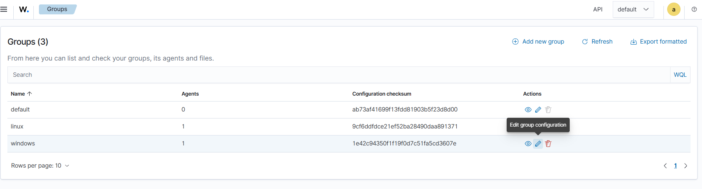

---

### Step 20 — Add the Sysmon Event Channel localfile Block

The following localfile block instructs the Wazuh Windows agent to collect the Sysmon Operational event channel:

```xml
<localfile>
    <location>Microsoft-Windows-Sysmon/Operational</location>
    <log_format>eventchannel</log_format>
</localfile>
```


> **Note:** On newer versions of Wazuh, this Sysmon localfile block may already be present in the Windows group configuration. If it already exists, do not duplicate it.

After this, the agent can be visualized in the Wazuh web UI. The raw notes referred to this as Kibana/Wazuh web UI and also noted that Grafana will be handled in a future guide.

---

## 8. Validate Windows Telemetry and Troubleshoot Wazuh Manager

### 8.1 Expected Visibility Path

After the Windows group configuration was updated, logs should arrive at the Wazuh Manager and be visible under Threat Hunting in the Wazuh web interface once the relevant alert indices and data views are available.

The raw notes then captured a Wazuh Manager service problem that had to be fixed before normal validation could continue.

### 8.2 Issue: Wazuh Manager Service Failed to Start

The Wazuh Manager service was unable to run on the wazuh-manager server. The captured service status showed the manager failing with an exit-code result. The journal output also reported an XML read/configuration problem for ossec.conf around line 4.

```bash
sudo systemctl restart wazuh-manager
sudo systemctl status wazuh-manager
journalctl -u wazuh-manager -xe --no-pager
```

The captured output included:

```text
Active: failed (Result: exit-code)
wazuh-analysisd: ERROR: (1226): Error reading XML file 'etc/ossec.conf': (Line 4)
wazuh-analysisd: Configuration error. Exiting
```

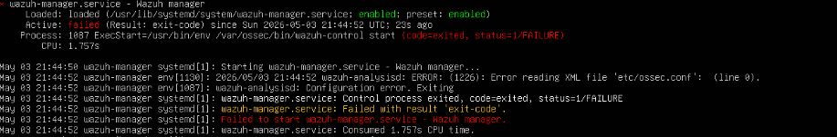

### 8.3 Root Cause: ossec.conf Ownership and Permissions Were Wrong

The root cause identified in the raw notes was incorrect permissions and ownership on /var/ossec/etc/ossec.conf. They had been reset during testing when a backup was created and the original file was deleted/recreated.

The directory listing showed ossec.conf owned by root:root instead of root:wazuh. That prevented the Wazuh process from reading the configuration correctly.

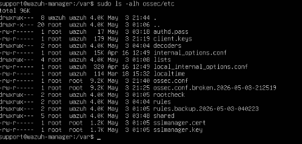

### 8.4 Fix: Restore Correct ossec.conf Permissions and Ownership

The fix was to restore the expected mode and group ownership on the Wazuh Manager configuration file:

```bash
sudo chmod 640 /var/ossec/etc/ossec.conf
sudo chown root:wazuh /var/ossec/etc/ossec.conf
```

After the fix, the Wazuh Manager service was restarted and confirmed active.

```bash
sudo systemctl restart wazuh-manager.service
sudo systemctl status wazuh-manager.service
```

The corrected service state showed:

```text
Active: active (running)
Started wazuh-authd
Started wazuh-remoted
Started wazuh-logcollector
Started wazuh-modulesd
```

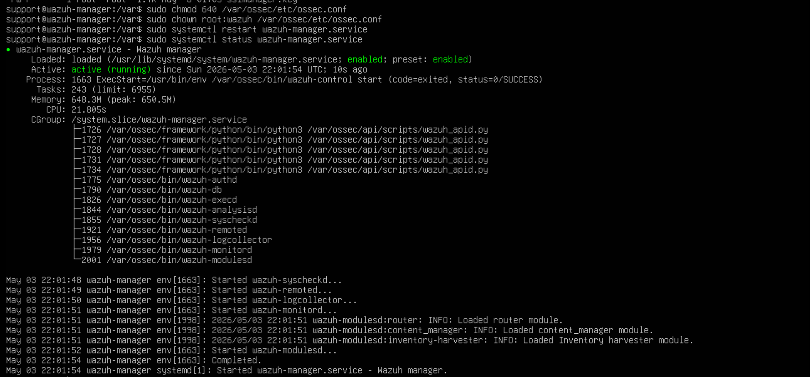

### 8.5 Confirm Events on the Wazuh Manager Command Line

Alerts and archives were visible from the Wazuh Manager command line, confirming that the manager was receiving and processing endpoint events. The raw notes also recorded that the Dashboard did not display the events yet because the alert index pattern/data view had not been configured.

> **Important:** Dashboard visibility depends on Wazuh alert indices such as wazuh-alerts-* or wazuh-alerts-4.x-* being present and mapped in the Wazuh Dashboard data view. Command-line visibility on the manager confirms event receipt even if the Dashboard view is not ready yet.

The captured validation command filtered the archives file for the Windows agent, Sysmon, and related Windows event channels:

```bash
sudo tail -f /var/ossec/logs/archives/archives.json | grep -Ei "002|windows-server-2025-1|Sysmon|Microsoft-Windows-Sysmon"
```

The screenshot shows Windows eventchannel data arriving from agent 002, windows-server-2025-1 at 192.168.71.202. The visible event includes Microsoft-Windows-PowerShell/Operational telemetry and confirms that the manager was ingesting Windows endpoint logs.

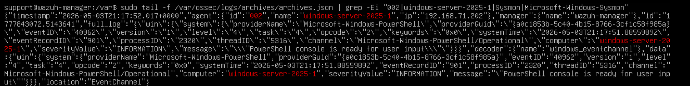

---

## 9. Configure Packetbeat on the Debian 12 Endpoint

### 9.1 Purpose and Version Decision

Sysmon adds richer telemetry on the Windows endpoint. For the Linux endpoint, Packetbeat was configured to analyze network traffic in real time. The raw notes intentionally used Packetbeat 7.16.3 for this stage and noted that a future upgrade to the latest stable release may be performed later.

The Packetbeat configuration used in the install script sends Packetbeat output to /tmp/packetbeat/packetbeat. The Wazuh agent is then configured to collect that JSON log file and forward it to the Wazuh Manager.

> **Note:** This demonstrates a useful Wazuh pattern: a separate endpoint tool can generate telemetry, and the Wazuh agent can collect the resulting log file as long as the file format and path are configured correctly.

---

### Step 21 — Packetbeat Install Script from SOCFortress

The following script installs Packetbeat and downloads the Packetbeat configuration from the SOCFortress Wazuh-Rules repository. The raw notes credited SOCFortress for the script/configuration source.

```bash
#!/bin/bash
PATH=/usr/local/sbin:/usr/local/bin:/usr/sbin:/usr/bin:/sbin:/bin
PACKETBEAT_YAML="https://raw.githubusercontent.com/socfortress/Wazuh-Rules/main/Packetbeat/packetbeat.yml"

logger() {

    now=$(date +'%m/%d/%Y %H:%M:%S')
    case $1 in
        "-e")
            mtype="ERROR:"
            message="$2"
            ;;
        "-w")
            mtype="WARNING:"
            message="$2"
            ;;
        *)
            mtype="INFO:"
            message="$1"
            ;;
    esac
    echo $now $mtype $message
}

if [ -n "$(command -v yum)" ]; then
    sys_type="yum"
    sep="-"
elif [ -n "$(command -v zypper)" ]; then
    sys_type="zypper"
    sep="-"
elif [ -n "$(command -v apt-get)" ]; then
    sys_type="apt-get"
    sep="="
fi

DIR="/etc/packetbeat"
if [ -d "$DIR" ]; then
        logger "Packetbeat found. Not Installing"
        exit 0
else
logger "Installing Packetbeat"
        if [ ${sys_type} == "yum" ]; then
        eval "curl -L -O https://artifacts.elastic.co/downloads/beats/packetbeat/packetbeat-7.16.3-x86_64.rpm ${debug}"
        eval "rpm -vi packetbeat-7.16.3-x86_64.rpm ${debug}"
        eval "wget ${PACKETBEAT_YAML} -O /etc/packetbeat/packetbeat.yml ${debug}"
        elif [ ${sys_type} == "apt-get" ]; then
        eval "curl -L -O https://artifacts.elastic.co/downloads/beats/packetbeat/packetbeat-7.16.3-amd64.deb ${debug}"
        eval "dpkg -i packetbeat-7.16.3-amd64.deb ${debug}"
        eval "wget ${PACKETBEAT_YAML} -O /etc/packetbeat/packetbeat.yml ${debug}"
        fi
    fi
    service packetbeat restart
```

---

### Step 22 — Install curl and Execute the Packetbeat Script

Before running the script on debian12-1, curl had to be installed. The first attempt was run without sudo and failed because apt could not acquire the dpkg frontend lock.

```bash
apt install curl
```

The failed output showed:

```text
E: Could not open lock file /var/lib/dpkg/lock-frontend - open (13: Permission denied)
E: Unable to acquire the dpkg frontend lock (/var/lib/dpkg/lock-frontend), are you root?
```

The corrected command used sudo:

```bash
sudo apt install curl
```

After curl was installed, the Packetbeat script was executed:

```bash
sudo ./script.sh
```

The script output showed Packetbeat being installed, packetbeat-7.16.3-amd64.deb being unpacked, and /etc/packetbeat/packetbeat.yml being downloaded from the SOCFortress repository. The output also showed the SOCFortress message: Need assistance? Shoot us an email at info@socfortress.co!

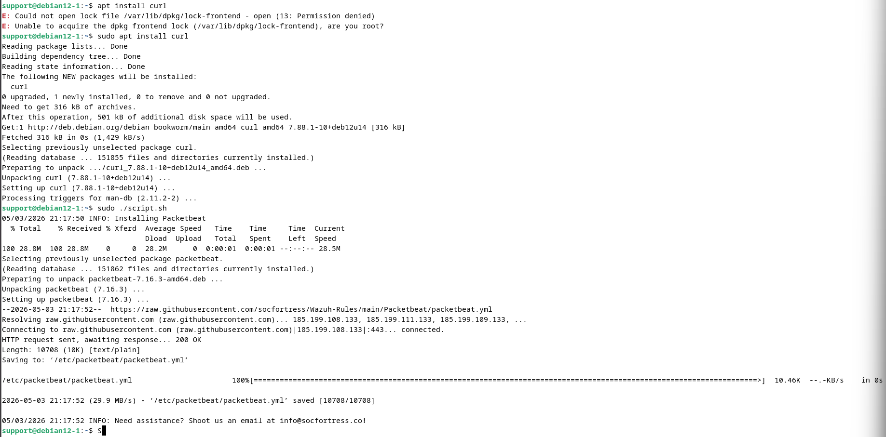

---

### Step 23 — Confirm Packetbeat Writes Real-Time JSON Traffic

The Packetbeat configuration writes JSON event output to /tmp/packetbeat/packetbeat. Live network traffic was viewed with:

```bash
sudo tail -f /tmp/packetbeat/packetbeat
```

The screenshot shows Packetbeat JSON flow records with agent.name and host.hostname set to debian12-1, Packetbeat version 7.16.3, network traffic fields, source and destination addresses, and a visible flow from 192.168.71.201 to 192.168.71.102 on TCP port 1514. That port is the Wazuh agent event channel, which confirms Packetbeat can also observe traffic between the Linux agent and the Wazuh Manager.

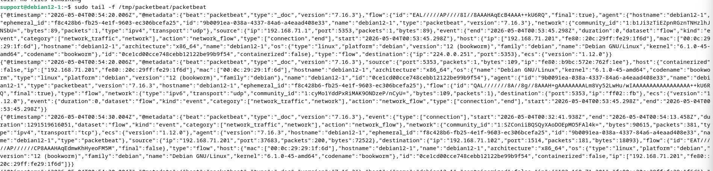

---

## 10. Configure the Linux Wazuh Group to Collect Packetbeat Output

### Step 24 — Add the Packetbeat localfile Block to the Linux Group

The Wazuh agent on the Debian host must be told to collect the Packetbeat output file. Because the Debian endpoint belongs to the linux group, the following localfile block was added to the linux group configuration in the Wazuh web UI:

```xml
<localfile>
    <log_format>json</log_format>
    <location>/tmp/packetbeat/packetbeat</location>
</localfile>
```

The log_format is json because Packetbeat writes structured JSON events to the target file. The location points to the Packetbeat output path configured by the downloaded Packetbeat YAML.

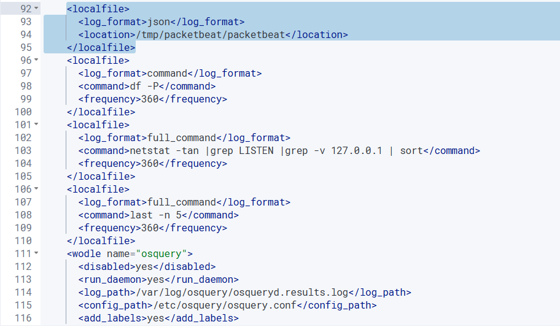

---

## 11. Verification Checklist

| Validation Item | Status |
| --- | --- |
| Wazuh Manager ports 1514 and 1515 verified as listening | Completed |
| Debian 12 agent deployment generated in Wazuh Dashboard | Completed |
| Debian 12 agent package wazuh-agent 4.14.3-1 installed | Completed |
| Debian agent service enable/start commands preserved | Completed |
| Windows Server 2025 VM created with 4 cores, 8 GB RAM, and 60 GB disk | Completed |
| Windows Wazuh agent deployment generated and run as Administrator | Completed |
| Windows Wazuh service started successfully | Completed |
| Sysmon initial failed install attempts preserved | Completed |
| Stale Sysmon Event Log registration identified and cleaned | Completed |
| Sysmon installed after reboot and configuration applied | Completed |
| Windows group configured to collect Microsoft-Windows-Sysmon/Operational | Completed |
| Wazuh Manager service failure documented and fixed by correcting ossec.conf permissions | Completed |
| Windows endpoint event data confirmed from Wazuh Manager archives file | Completed |
| curl prerequisite issue on Debian captured and corrected | Completed |
| Packetbeat 7.16.3 installed with SOCFortress configuration | Completed |
| Packetbeat JSON output confirmed at /tmp/packetbeat/packetbeat | Completed |
| Linux group configured to collect Packetbeat JSON output | Completed |

---

## 12. Observations and Notes

### 12.1 Wazuh Agent Enrollment Has Two Distinct Phases

Registration happens on TCP 1515 through wazuh-authd. Normal event collection happens on TCP 1514 through wazuh-remoted. Seeing both ports listening on the manager is a useful pre-deployment validation step.

### 12.2 Agent Status May Temporarily Show Never Connected

The screenshots show agents appearing in the Wazuh UI before they are fully active. That does not always mean deployment failed. It can simply mean the agent has not sent its first heartbeat yet, the service has not been started, or the UI has not refreshed.

### 12.3 Sysmon Download Is Not the Same as Sysmon Installation

The Sysmon troubleshooting section matters because downloading Sysinternals or Sysmon binaries does not install the Sysmon service. The service must be installed with Sysmon64.exe -accepteula -i, and stale Event Log registration can prevent a clean install.

### 12.4 Stale Windows Event Log Registration Can Break Sysmon Install

The manifest failure was misleading because the message included The operation completed successfully even though installation failed. The decisive clue was that the Sysmon service was missing while Microsoft-Windows-Sysmon/Operational still appeared in wevtutil output.

### 12.5 Wazuh Manager Configuration File Ownership Matters

The ossec.conf file must be readable by the Wazuh service. In this lab, deleting and recreating the file during testing reset ownership to root:root. Restoring chmod 640 and chown root:wazuh fixed the manager startup problem.

### 12.6 Dashboard Visibility Depends on Indices and Data Views

Command-line confirmation on the Wazuh Manager proved events were being received. The Dashboard did not immediately show those events because the alert index pattern/data view had not been configured. That is a visibility/configuration issue, not proof that ingestion failed.

### 12.7 Packetbeat Extends Linux Network Visibility

Packetbeat produced real-time JSON network flow records and wrote them to /tmp/packetbeat/packetbeat. Collecting that file through Wazuh lets the SIEM ingest network telemetry from the Linux endpoint without replacing the Wazuh agent.

---

## 13. Conclusion

Part 5 deployed Wazuh agents to both a Debian 12 endpoint and a Windows Server 2025 endpoint, validated agent enrollment in the Wazuh web UI, extended Windows telemetry with Sysmon, configured Wazuh to collect Sysmon events, troubleshot and fixed a Wazuh Manager service failure caused by ossec.conf ownership/permission issues, installed Packetbeat on Debian 12, confirmed live Packetbeat JSON network flow output, and configured the Linux Wazuh group to collect that Packetbeat output file.

At the end of this part, the SIEM HomeLab has endpoint agents deployed and enhanced endpoint telemetry sources in place. The Windows endpoint can provide Windows Event Channel and Sysmon telemetry, while the Debian endpoint can provide Wazuh agent logs plus Packetbeat network flow records.

Next: SIEM HomeLab - Part 6: Routing with Graylog.
